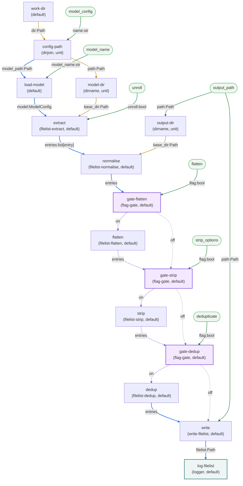

# `filelist` Graph Dataflow Diagram

[Back to the `filelist` graph](filelist.md) · [graphs index](index.md)

The full dataflow of the `filelist` graph, rendered inline by GitHub. Node labels note the module and pairing contract in parentheses; edge labels show the payloads carried (`port:Type`). Colour key: solid blue = main pipeline, amber dashed = config/base_dir, purple = flag-gated bypass, green = CLI inputs. Gate nodes are purple-filled.

