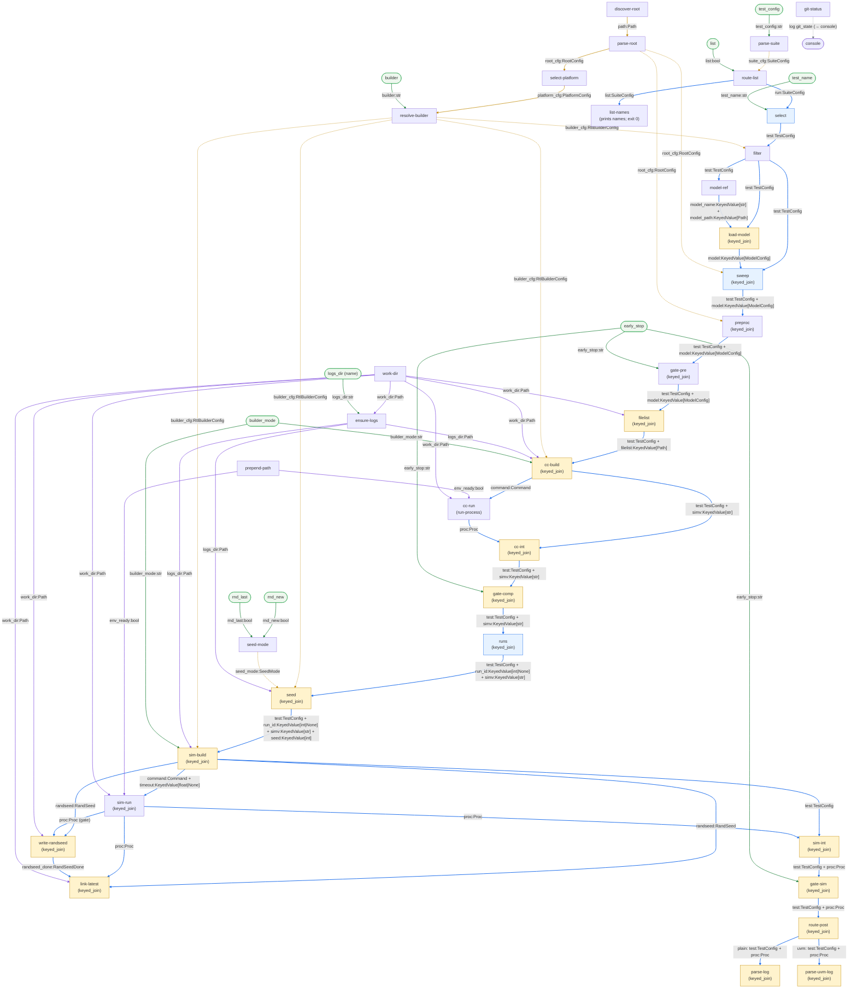

# `test` Graph Dataflow Diagram

[Back to the `test` graph](test.md) · [graphs index](index.md)

The full dataflow of the `test` graph, rendered inline by GitHub. Node labels note the pairing contract in parentheses; edge labels show the payloads carried (`port:Type`, with `#124;` rendering as `|`). Colour key: solid blue = main line, amber dashed = persistent config, purple = env / work-dir, green = CLI inputs.

