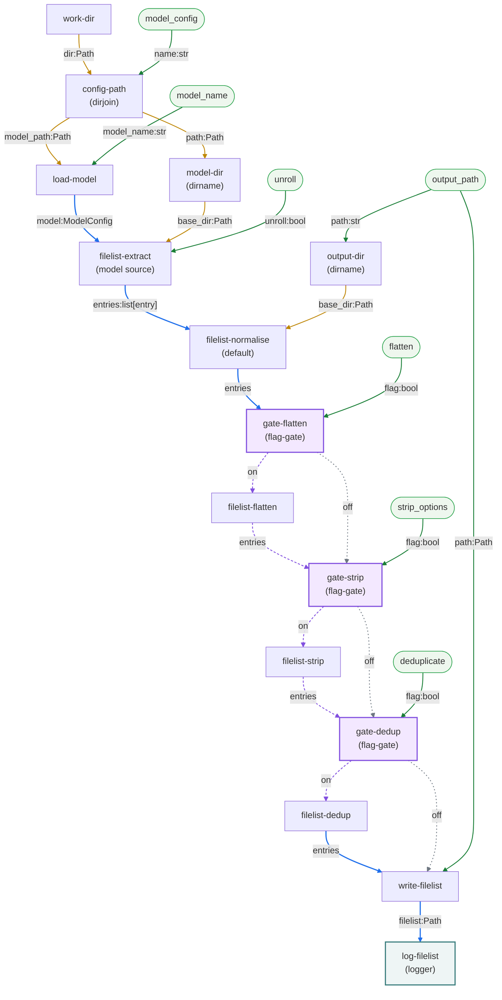

# Overview

## Goal

Generate a test's compile filelist (`run.<tag>.f`) as a **pipeline of atomic `rtl-comrade` nodes** rather than one fused module — a pipeline shared by the `test`/`randtest`/`regression` graphs and the standalone `filelist` command, differing only in which nodes are wired.

> **Baseline.** These specs reimplement rtl_buddy's filelist handling (`rtl_buddy/src/rtl_buddy/tools/vlog_filelist.py`) and replace implementation-test's fused `write-filelist` node ([spec 06b](../implementation-test/specs/06b-write-filelist.md)). The pinned rtl_buddy version and the `Compatibility source:` citation rules are those of [implementation-test's overview](../implementation-test/00-overview.md#goal) — every file:line reference here is anchored to that same tree.

## Why this pipeline exists

implementation-test's `write-filelist` (spec 06b) is one node doing every filelist job — read+unroll sources, rewrite/flatten/strip/dedup the entries, and write the `.f` — with the read/rewrite logic buried in module-level free functions (`filelist_extract`/`filelist_process`). That is composition happening in Python import-space where the graph cannot see it, and it forces a fixed feature set: 06b hard-codes `flatten=False, strip=False, deduplicate=True` (matching `VlogSim._write_filelist`), so the `flatten`/`strip` capabilities were *deleted* to fit the test-only scope rather than left unwired.

The lesson from that deletion is the design driver: **a capability difference between commands should be which nodes are wired, not a boolean baked into code.** Had processing been a pipeline of atomic transforms, shrinking to the test scope would have left `flatten`/`strip` as unwired nodes, not amputated code — and porting the `filelist` command (which needs them) would be re-wiring, not re-adding code. So filelist processing decomposes into a pipeline of composable `entries → entries` transforms.

## The pipeline at a glance

The diagram is the `filelist` command's graph. `work-dir` provides CWD; `config-path` ([dirjoin](15-dirjoin.md)) resolves the CLI `model_config` filename against it; `load-model` resolves the model; `filelist-extract` turns its filelist into entries; the transforms rewrite `entries → entries`; `write-filelist` renders and writes; `log-filelist` reports where. Each `entry` is a `FilelistEntry` (`path` + `option` — [spec 01](01-filelist-entry.md)), travelling as a bare `list[entry]`. The `test`/`randtest`/`regression` graphs wire the same nodes keyed, one filelist per test: `KeyedValue[list[entry]]` under `test.key`, with `prioritised-merge` and `write-filelist` on `keyed_join` and `unwrap: true`.

`--flatten`/`--strip-options`/`--deduplicate` arrive per invocation (`rtl_buddy.py:445-447`, each defaulting `False`), so each of `filelist-flatten`/`filelist-strip`/`filelist-dedup` sits behind a [flag-gate](09-flag-gate.md): the `on` arm runs the transform, the `off` arm bypasses it, and the two rejoin on the next node's input port.



## Head

Everything ahead of `filelist-extract` is [load-model](../docs/modules/load-model.md), which the harness already has: `LoadModelMod` (`modules/rtl_buddy/setup.py:233-257`) parses a `models.yaml`, looks the entry up by name, and builds `ModelConfig(name, filelist, path=str(model_path))` — the same three steps as rtl_buddy's `ModelConfigLoader(model_config).get_model(model_name)` (`rtl_buddy.py:452`, `model.py:74-100`), down to stamping the config file's own path onto the record.

`filelist-extract` resolves against a `base_dir` the graph supplies (spec [02](02-filelist-extract.md)) rather than one derived from the record, so the graph wires it three things: the record, `base_dir`, and `unroll`. A `filelist` is a field inline in a config file, so a record-derived directory is always the holding file's — right for a `ModelConfig`, wrong for the `test` graph's testbench, where both references root entries on the working directory instead. One rule cannot serve both sources; each instance is wired its own.

`write_output` (`vlog_filelist.py:137-159`) is the fused method the whole plan decomposes — it computes those roots, calls `_extract` per source, calls `_process`, and writes the `.f`.

The command extracts a single source: it calls `write_output` with no `test_filelist` (`rtl_buddy.py:457`) where the sim path passes `self.testbench.get_filelist()` (`vlog_sim.py:93`), so the second `_extract` (149-151) never runs and [prioritised-merge](08-prioritised-merge.md) has nothing to merge. And with one model, one invocation and one `.f`, there is nothing to correlate: entries travel as a bare `list[entry]`, no node runs `keyed_join`, and `write-filelist`'s `filelist` port feeds nothing but the report.

## Nodes

| node | spec | role | in `filelist` (drawn) | in test/randtest/regression |
|---|---|---|---|---|
| `filelist-extract` | [02](02-filelist-extract.md) | source record's filelist → entries resolved from `base_dir` | one — model only, `base_dir = dirname(model_config)` | one per source: model, `base_dir = dirname(models.yaml)`; testbench, `base_dir = work_dir` |
| `prioritised-merge` | [08](08-prioritised-merge.md) | ordered per-source fan-in (model before tb) | unwired — single source | always |
| `filelist-normalise` | [03](03-filelist-normalise.md) | relativize against `base_dir` + existence-warn | always, `base_dir = dirname(output_path)` | always, `base_dir = work_dir` |
| `filelist-flatten` | [04](04-filelist-flatten.md) | `basename` each path | gated on `--flatten/-f` | absent |
| `filelist-strip` | [05](05-filelist-strip.md) | drop the option token | gated on `--strip/-s` | absent |
| `filelist-dedup` | [06](06-filelist-dedup.md) | drop duplicate entries | gated on `--deduplicate/-d` | always (unconditional) |
| `write-filelist` | [07](07-write-filelist.md) | render entries → `.f`, write | always, feeds `log-filelist` | always, feeds `cc-build` |

The manifest that registers all seven with `modules/config.yaml` is in [spec 02 Deliverables](02-filelist-extract.md#deliverables); each node's spec points there.

`gate-flatten`/`gate-strip`/`gate-dedup` are three instances of one payload-agnostic [flag-gate](09-flag-gate.md), a graph-control node registered under `rtl_buddy/control.py` beside `early-stop-gate` rather than with the seven.

`log-filelist` is an instance of [logger](11-logger.md), a generic module in `modules/funcs.py`. It is the graph's terminal node and the only thing this command prints on a clean run — rtl_buddy reports the written path from inside `write_output` itself (`vlog_filelist.py:158`), where the writer here emits `filelist` and a node downstream decides whether that is worth reporting:

```yaml
- id: log-filelist
  module:
    name: logger
    config:
      level: info
      event: filelist_written
      mapping: path
  contract: default
```

`test`/`randtest`/`regression` wire none of it — there `write-filelist`'s `filelist` port feeds `cc-build`, and per-test reporting is the summary processors' job.

## Ordering and seams

A finding pins the ordering and the seams: **nothing consumes the intermediate entries before the write** (rtl_buddy `_extract`/`_process` are called only inside `write_output`; `vlog_filelist.py:137-159`). So no placement is forced by dataflow — each transform is placed by *function*, and the graph orders them:

- `os.path.relpath` turns a resolved entry into its emitted form → it lives in `normalise` ([03](03-filelist-normalise.md)), not `extract`.
- `flatten` (`basename`) must run **after** `normalise`, or the discarded directory would make `relpath` mangle a bare filename ([04](04-filelist-flatten.md)).
- `dedup` must run **last** among the transforms: `flatten`/`strip` create new duplicates (shared basenames; entries differing only in option), so deduping earlier would miss them ([06](06-filelist-dedup.md)).

