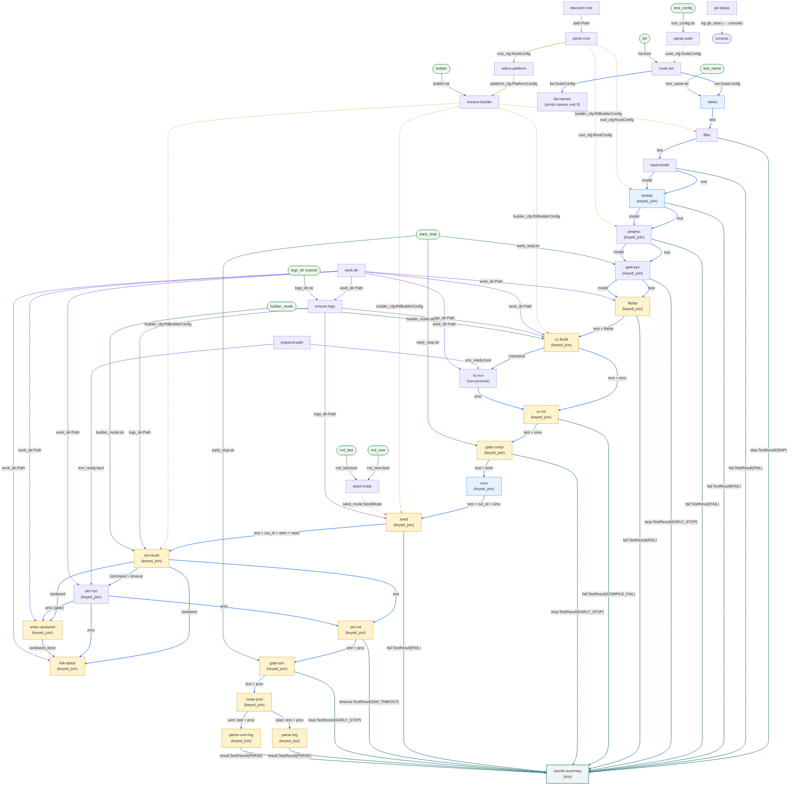

# Overview

## Goal

Reproduce the behaviour of `rtl_buddy test` as an `rtl-comrade` graph.

> **Source baseline.** This plan mirrors **rtl_buddy `v1.4.0`** (commit
> `a69d962f5c42f859f320984129cca0435b0cba36`), expected as a sibling checkout at
> `rtl_buddy/` in the repo root. Every `Source:` / `Compatibility source:` file:line
> citation across these docs and `specs/` is anchored to that version; if rtl_buddy is
> updated, re-verify every cited range.

`rtl_buddy test` (traced from `rtl_buddy/src/rtl_buddy/`) does, in one sequential
in-process pass:

1. load `root_config.yaml` (walk up the tree, pick a platform by `uname`, resolve a builder)
2. load the suite `tests.yaml` (and each test's `models.yaml` + testbenches)
3. select one test or all tests
4. (regression only) filter tests by regression level
5. expand each test through an optional `sweep` script into N variants
6. for each test: run an optional `preproc` script, write a filelist (`run.f`), compile
7. for each run-id: resolve a seed, simulate (with timeout), parse the log into a result
8. aggregate all results, print a summary, exit `0` iff every result is PASS/SKIP

The whole thing is sequential, mutation-heavy, and short-circuits on the first failure
of each test (compile fail → no sim; timeout → no post; `--early-stop` → stop at a phase).

## Design philosophy

1. **Phases are tags, not structure.** `pre`/`compile`/`sim`/`post` are labels on the
   modules that happen to do that kind of work, not structural boundaries. The real unit
   is the smallest piece of node-local work.

2. **Atomic modules; coordination in contracts.** Every module declares exactly the inputs
   it consumes as **granular named ports** the harness can see and validate, does its work,
   and emits named outputs. Modules contain **no scheduling** — no "should I run", no
   passthrough guards, no awareness of the graph. *All* coordination (when a node runs,
   which inputs are matched, how branches re-converge) lives in contracts, and **we author
   the contracts the design needs** — contracts are plugins, not framework internals.

3. **Branching is data routing via output ports; the summary is one in-graph node.** A stage
   that produces a terminal outcome (skip, early-stop, compile-fail, timeout, parsed result)
   emits it on a dedicated output port that routes the item *off the main line*. Items that
   continue stay on the main line. Because terminal items leave, downstream stages never see
   them — which is why no module needs a guard. The 13 result ports fan into a single
   **`results-summary`** node (the `any` contract is the fan-in; no relay), which renders the
   PASS/FAIL/NA table in its `finalise()` hook from the `TestResult` payloads — `test_name` rides
   the payload as the table's first column (spec [10d](specs/10d-summarise-results.md)). The exit
   code is driven by `log.error` at two layers: each failure terminal's own **per-case** event at
   origin (`compile_failed`/`sim_timeout`/`model_*`/`sweep_*`/`preproc_*`/`filelist_*`/`replay_seed_*`/`parse_log_*`/`parse_uvm_*` — no generic
   `test_result`), plus the consolidated `test_failures` error `finalise()` emits on any FAIL row.
   `git-status` logs its git stateline separately and it falls through to the console. (An earlier TODO #15 draft
   rendered the table out-of-graph via a `SummaryProcessor` logging plugin, now dormant —
   [10c](specs/10c-summary-handler.md).) See [05](05-branching-and-results.md).

4. **`compile` and `sim` are one reusable module.** `run-process` — `run(self, command,
   timeout=None) -> {rc, stdout_path, stderr_path}` (`rc is None` ⟺ timed out) — is the single subprocess
   primitive, wired twice. It **redirects** stdout/stderr to caller-supplied files (paths in
   `command`), so partial output survives a timeout and memory stays bounded.

5. **Reimplement rtl_buddy, preserve only the config surface.** Modules reimplement
   `rtl_buddy`'s behaviour natively rather than wrapping its classes; **rtl_buddy is not a
   runtime dependency** — do not `import` it, subclass it, or call into it from
   `modules/rtl_buddy/`. The `Compatibility source:` file:line citations are read-only
   references to reimplement from (and the oracle the parity tests compare against), never
   import targets; see the [specs README preamble](specs/README.md). Only the config-file
   schema (`root_config.yaml`, `tests.yaml`, `models.yaml` field names/structure) is kept
   identical, so existing config files run drop-in. This is what frees the monolithic
   `RootConfig`/`SuiteConfig` loaders to be split into atomic nodes (`discover-config-file`,
   `parse-root-config`, `select-platform`, `resolve-builder`, `parse-suite-config`,
   `load-model`). See [07](07-ambiguities-and-assumptions.md) item 1.

## Correlation: a minimal context record + joins only where streams diverge

With no god-object carrying everything, a stage needs its inputs *matched up* under
concurrency. The chosen strategy (see [02](02-payload-conventions.md)):

- **Per-test data rides as separate keyed edges, not a bag.** Each is a `{key, value}` dict
  (Shape 1 in [02](02-payload-conventions.md)): `test` threads the whole pipeline; `simv`,
  `run_id`, and `seed` are born at `build-compile-cmd` / `expand-runs` / `resolve-seed` and
  **die at `build-sim-cmd`**. There is **no `ctx` and no `test_run`** — the post-sim region
  consumes `test` + `proc` + `randseed` directly. Cohesive multi-field messages (`command`,
  `proc`, `randseed`) keep named fields (Shape 2). No `result` field ever enters a main-line edge.
- A stable **correlation key** defaults to `name` (`TestConfig.__post_init__`, so the test is
  born self-keyed) and is refined at each fan-out (`sweep`→`name#i`, `runs`→`name#i#run`),
  carried on **every** edge.
- **Joins are by key, pervasively.** Every node consuming ≥2 keyed edges is a `keyed_join`
  correlating them by key — the command-builders, the interpret/route/parse nodes, and the
  multi-edge gates; config singletons reach them as `persistent_inputs`.
  Single-keyed-input nodes stay `default`. This replaces the bag design's
  reliance on lockstep arrival order with explicit key correlation.

This is the explicit difference from the rejected single-envelope design: there is no envelope
at all — each node's inbound edges are exactly its inputs, modules read only the ports they
declare, and no module contains scheduling. The full node/contract/edge table and edge-wiring
list are in [`06-graph-yaml.md`](06-graph-yaml.md).

## End-to-end dataflow at a glance

The whole graph in one Mermaid flowchart, rebuilt from the authoritative edge list in
[`06-graph-yaml.md`](06-graph-yaml.md). Edges are **colour- and style-coded by type** so a
reviewer can trace any one type without another crossing it:

Edges are labelled with the payload(s) they carry (multi-edge lockstep edges as `a + b`); the
work-spine payloads (`test`, `model`, `simv`, `run_id`, `seed`, `timeout`, `command`, `proc`, `filelist`,
`randseed`, `randseed_done`, `result`) are plain dicts whose shapes are pinned in [02](02-payload-conventions.md), while
config/setup edges carry concrete classes (`RootConfig`, `RtlBuilderConfig`, `SuiteConfig`, …)
or scalars (`Path`, `bool`, `str`). Colours:

- **blue, bold** — main-line continue ports (the work spine), each labelled with its payload;
- **teal, solid** — the 13 result ports routing an item *off the main line* into the
  `results-summary` sink (fanned in by the `any` contract);
- **grey, dashed** — `git-status`'s lone stateline edge, which falls through to the console (not a result port);
- **orange** — setup chain + persistent config broadcasts (`root_cfg`, `builder_cfg`, …);
- **purple** — env-setup ordering plus artefact-dir provenance: the `$PATH` prepend is sequenced
  by `prepend-path`'s `env_ready` token wired **directly** to each `run-process` (edge
  `required: true` + `env_ready` persistent — `required` blocks the first subprocess until PATH is
  set, `persistent` replays the once-emitted token); the `logs/` `mkdir` is ordered by the
  `logs_dir` **data** edge — the zero-input `work-dir` node emits `work_dir` (= CWD), which `ensure-logs` roots `logs/` on
  (emitting the resolved directory `Path` to the path composers) and which `filelist` / `cc-build`
  root `run.<tag>.f` / `obj_dir_<tag>/` on directly;
- **green** — CLI subcommand options (rounded nodes).

`select`/`sweep`/`runs` are the only fan-out generators; under the split **most main-line nodes
are now `keyed_join`** (correlation by key is pervasive) — the command-builders, the interpret/
route/parse nodes, and the multi-edge gates. The same node names appear in the [04 node table](04-pipeline-and-contracts.md#node-table).

There is **one fan-in sink** — the 13 result ports wire into `results-summary`, where the
`any` contract fans them in (no relay) and the node renders the table in `finalise()` (spec
[10d](specs/10d-summarise-results.md)). Under the split, most main-line nodes are `keyed_join` (they correlate ≥2
keyed edges by key); only the single-keyed-input nodes (`filter`, `load-model`) stay `default`
(`sweep`/`preproc`/`gate-pre` became `keyed_join` once the `model` edge began riding alongside
`test` through them), with `select`/`sweep`/`runs` the fan-out generators.

## Why this maps cleanly

| rtl_buddy concept | rtl-comrade realisation |
|---|---|
| `RtlBuddy` + `TestRunner` orchestration & loops | graph topology + contracts |
| nested `for test / for run_id` loops | fan-out generator modules (`select`, `sweep`, `runs`) |
| early `return CompileFailResults` etc. | named output port routes the item off the main line |
| `--early-stop` phase truncation | `early-stop-gate` nodes emitting on `stop` |
| compile vs sim | one reusable `run-process` module + two command builders |
| matching async results to their test | `keyed_join` on the correlation key (at `cc-int`, the sim-side nodes, and every multi-edge node) |
| collecting all outcomes | the 13 result ports fan into the `results-summary` node (the `any` contract) → it renders the table from the `TestResult` payloads in `finalise()` |
| OR-accumulated exit code | per-case `log.error` at each failure terminal + `results-summary.finalise()`'s consolidated `test_failures` error (harness maps ERROR → exit 1) |
| git state recorded | `git-status` setup node `log.info("git_state", …)` → falls through to the console (not in the summary table) |
| `RootConfig`/`SuiteConfig` monolithic loaders | reimplemented as atomic setup nodes; config schema preserved |
