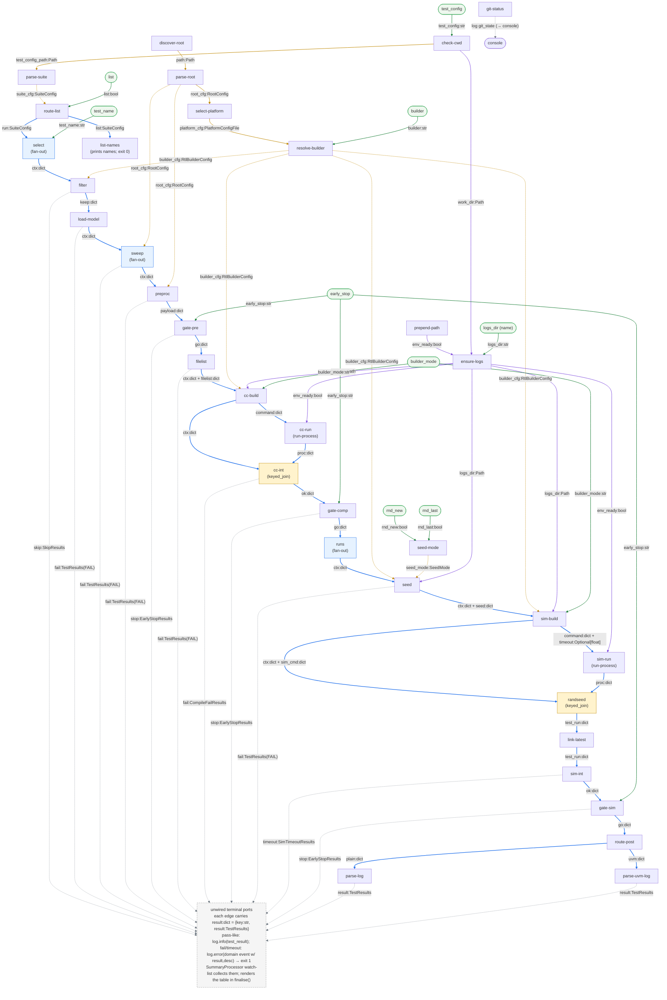

# Overview

## Goal

Reproduce the behaviour of `rtl_buddy test` as an `rtl-comrade` graph.

> **Source baseline.** This plan mirrors **rtl_buddy `v1.4.0`** (commit
> `a69d962f5c42f859f320984129cca0435b0cba36`), expected as a sibling checkout at
> `rtl_buddy/` in the repo root. Every `Source:` / `Compatibility source:` file:line
> citation across these docs and `specs/` is anchored to that version; if rtl_buddy is
> updated, re-verify every cited range.

`rtl_buddy test` (traced from `rtl_buddy/src/rtl_buddy/`) does, in one sequential
in-process pass:

1. load `root_config.yaml` (walk up the tree, pick a platform by `uname`, resolve a builder)
2. load the suite `tests.yaml` (and each test's `models.yaml` + testbenches)
3. select one test or all tests
4. (regression only) filter tests by regression level
5. expand each test through an optional `sweep` script into N variants
6. for each test: run an optional `preproc` script, write a filelist (`run.f`), compile
7. for each run-id: resolve a seed, simulate (with timeout), parse the log into a result
8. aggregate all results, print a summary, exit `0` iff every result is PASS/SKIP

The whole thing is sequential, mutation-heavy, and short-circuits on the first failure
of each test (compile fail → no sim; timeout → no post; `--early-stop` → stop at a phase).

## Design philosophy

1. **Phases are tags, not structure.** `pre`/`compile`/`sim`/`post` are labels on the
   modules that happen to do that kind of work, not structural boundaries. The real unit
   is the smallest piece of node-local work.

2. **Atomic modules; coordination in contracts.** Every module declares exactly the inputs
   it consumes as **granular named ports** the harness can see and validate, does its work,
   and emits named outputs. Modules contain **no scheduling** — no "should I run", no
   passthrough guards, no awareness of the graph. *All* coordination (when a node runs,
   which inputs are matched, how branches re-converge) lives in contracts, and **we author
   the contracts the design needs** — contracts are plugins, not framework internals.

3. **Branching is data routing via output ports; the summary is a logging concern.** A stage
   that produces a terminal outcome (skip, early-stop, compile-fail, timeout, parsed result)
   emits it on a dedicated output port that routes the item *off the main line*. Items that
   continue stay on the main line. Because terminal items leave, downstream stages never see
   them — which is why no module needs a guard. There is **no collector node**: each terminal
   port is left unwired and its module additionally **logs its outcome** — the otherwise-silent
   paths (`parse-log`/`parse-uvm-log`, `filter.skip`, `early-stop`) emit a `test_result` event,
   while the failure terminals add `result`/`desc` to their existing `log.error`. A per-graph
   **`SummaryProcessor` logging plugin** collects those events via a configured watch-list and
   renders the table in its `finalise()` hook. `git-status` logs its git stateline separately and
   it falls through to the console. The exit code is driven by per-emission `log.error`. This is
   the TODO #15 redesign — see [05](05-branching-and-results.md).

4. **`compile` and `sim` are one reusable module.** `run-process` — `run(self, command,
   timeout=None) -> {rc, timed_out, stdout_path, stderr_path}` — is the single subprocess
   primitive, wired twice. It **redirects** stdout/stderr to caller-supplied files (paths in
   `command`), so partial output survives a timeout and memory stays bounded.

5. **Reimplement rtl_buddy, preserve only the config surface.** Modules reimplement
   `rtl_buddy`'s behaviour natively rather than wrapping its classes; only the config-file
   schema (`root_config.yaml`, `tests.yaml`, `models.yaml` field names/structure) is kept
   identical, so existing config files run drop-in. This is what frees the monolithic
   `RootConfig`/`SuiteConfig` loaders to be split into atomic nodes (`discover-config-file`,
   `parse-root-config`, `select-platform`, `resolve-builder`, `parse-suite-config`,
   `load-model`). See [07](07-ambiguities-and-assumptions.md) item 1.

## Correlation: a minimal context record + joins only where streams diverge

With no god-object carrying everything, a stage needs its inputs *matched up* under
concurrency. The chosen strategy (see [02](02-payload-conventions.md)):

- A stable **`ctx` record** `{key, test, run_id}` rides the main line from `select` through
  `write-randseed`. It is assembled at fan-out points and never modified: no stage adds
  fields. `simv` is set by `build-compile-cmd` and carried in `ctx` to `sim-build`.
  `seed`/`log`/`err`/`randseed_path` travel as `sim_cmd`, a keyed
  payload from `sim-build` to `write-randseed`. `write-randseed` assembles `test_run` once
  (from `ctx`, `proc`, and `sim_cmd`); the post-sim chain receives `test_run` in place of
  `ctx`. No `result` field ever enters either record.
- A stable **correlation key** is stamped at each fan-out (`select`→`name`,
  `sweep`→`name#i`, `runs`→`name#i#run`).
- **Joins happen only where a fast path meets a slow path**: the direct `ctx` edge meets
  the subprocess `proc` result at `interpret-compile` and `write-randseed` (the first sim-side
  node needing both). Those two nodes use `keyed_join` on the key. Everywhere else, a stage's
  inputs come from a single upstream in lockstep, so a plain `default` contract suffices.

This is the explicit difference from the rejected single-envelope design: `ctx` is a
*minimal, bounded* record of genuinely-pervasive values (not an accumulator), modules read
only the ports they declare, and no module contains scheduling.

## End-to-end dataflow at a glance

The whole graph in one Mermaid flowchart, rebuilt from the authoritative edge list in
[`06-graph-yaml.md`](06-graph-yaml.md). Edges are **colour- and style-coded by type** so a
reviewer can trace any one type without another crossing it:

Each edge is labelled `name:type` (lockstep multi-payload edges as `a:type + b:type`); the
work-spine payloads (`ctx`, `test_run`, `command`, `proc`, `filelist`, `seed`, `sim_cmd`,
`result`) are plain dicts whose shapes are pinned in [02](02-payload-conventions.md), while
config/setup edges carry concrete classes (`RootConfig`, `RtlBuilderConfig`, `SuiteConfig`, …)
or scalars (`Path`, `bool`, `str`). Colours:

- **blue, bold** — main-line continue ports (the work spine), each labelled with its payload;
- **grey, dashed** — the 13 **unwired** terminal ports routing an item *off the main line*
  (and `git-status`, which falls through to the console);
- **orange** — setup chain + persistent config broadcasts (`root_cfg`, `builder_cfg`, …);
- **purple** — env-setup sequencing (`env_ready`) plus artefact-dir provenance: `check-cwd`
  emits `work_dir`, `ensure-logs` roots `logs/` on it and emits the resolved directory `Path`
  to the path composers — ordering the `$PATH` prepend and `logs/` `mkdir` upstream of every
  subprocess;
- **green** — CLI subcommand options (rounded nodes).

`select`/`sweep`/`runs` are the only fan-out generators; `cc-int`/`randseed` the only joins
(`keyed_join`). The same node names appear in the [04 node table](04-pipeline-and-contracts.md#node-table).

There is **no fan-in node** — the 13 terminal ports are unwired and the summary is a logging
concern (TODO #15). Apart from the three fan-out generators and the two joins, every node is
single-input / single-output on a plain `default` contract.

## Why this maps cleanly

| rtl_buddy concept | rtl-comrade realisation |
|---|---|
| `RtlBuddy` + `TestRunner` orchestration & loops | graph topology + contracts |
| nested `for test / for run_id` loops | fan-out generator modules (`select`, `sweep`, `runs`) |
| early `return CompileFailResults` etc. | named output port routes the item off the main line |
| `--early-stop` phase truncation | `early-stop-gate` nodes emitting on `stop` |
| compile vs sim | one reusable `run-process` module + two command builders |
| matching async results to their test | `keyed_join` on the correlation key at `cc-int`/`randseed` |
| collecting all outcomes | each terminal logs its outcome (`test_result` from the silent paths; `compile_failed`/`sim_timeout`/`*_failed` from the failure terminals) → `SummaryProcessor` watch-list collects and renders the table |
| OR-accumulated exit code | per-emission `log.error` at each failure site (harness maps ERROR → exit 1) |
| git state recorded | `git-status` setup node `log.info("git_state", …)` → falls through to the console (not in the summary table) |
| `RootConfig`/`SuiteConfig` monolithic loaders | reimplemented as atomic setup nodes; config schema preserved |
