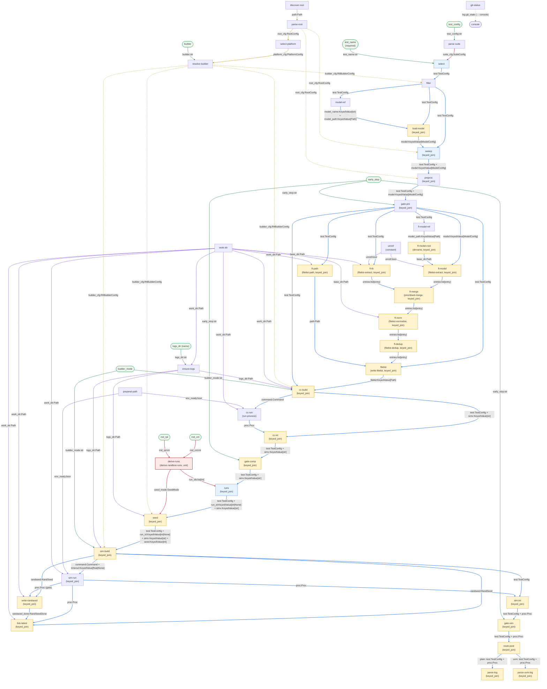

# Overview

## Goal

Port `rtl_buddy`'s `do_rand_test` command as a sibling `rtl-comrade` graph, derived from the existing `test` graph (`graphs/test.yaml`). The changes are small: one new module, CLI rewiring, removal of list mode.

> **Baseline.** This plan depends on the completed `test` graph and all modules in `modules/rtl_buddy/`. The pinned rtl_buddy version and the `Compatibility source:` citation rules are those of [implementation-test's overview](../implementation-test/00-overview.md#goal).

## Why a sibling graph

`randtest` differs from `test` in three ways:

1. **Seed derivation.** `test` wires `derive-seed-mode` (two booleans `rnd_new`/`rnd_last` → `SeedMode`). `randtest` replaces it with `derive-randtest-runs`, which collapses `rnd_cnt`/`rnd_rpt` into `run_ids` + `seed_mode` — a different CLI surface driving the same downstream `runs`/`seed` nodes.
2. **No list mode.** `test` has `route-list` (`flag-gate`) routing `parse-suite` to either `list-names` or `select`. `randtest` drops the gate and wires `parse-suite` directly to `select`.
3. **Required test name.** `test` defaults `test_name` to `""`. `randtest` makes it a required positional (no `default` field in the CLI edge).

Everything else carries over unchanged — setup chain, selection/expansion, filelist pipeline, compile, sim, post, logging, persistent-input configs.

## Full graph

The full dataflow of the `randtest` graph. Colour key: solid blue = main line, amber dashed = persistent config, purple = env / work-dir, green = CLI inputs, red = delta nodes/edges (new or rewired vs `test.yaml`).



## Graph delta summary

### Nodes removed (vs `test.yaml`)

| ID | Module | Reason |
|---|---|---|
| `seed-mode` | `derive-seed-mode` | Replaced by `derive-runs` |
| `route-list` | `flag-gate` | No list mode in randtest |
| `list-names` | `list-test-names` | No list mode in randtest |

### Nodes added

| ID | Module | Contract |
|---|---|---|
| `derive-runs` | `derive-randtest-runs` | `unit` |

### Edges removed

```yaml
# seed-mode wiring
- { src: { cli: rnd_new, ... },  dst: { node: seed-mode, port: rnd_new } }
- { src: { cli: rnd_last, ... }, dst: { node: seed-mode, port: rnd_last } }
- { src: { node: seed-mode },    dst: { node: seed, port: seed_mode } }

# list-mode wiring
- { src: { cli: list, ... },              dst: { node: route-list, port: flag } }
- { src: { node: parse-suite },           dst: { node: route-list, port: value } }
- { src: { node: route-list, port: "on" },  dst: { node: list-names, port: suite_cfg } }
- { src: { node: route-list, port: "off" }, dst: { node: select, port: suite_cfg } }
```

### Edges added

```yaml
# derive-randtest-runs CLI inputs
- { src: { cli: rnd_cnt, option: false, type: int, default: 2 }, dst: { node: derive-runs, port: rnd_cnt } }
- { src: { cli: rnd_rpt, type: int, default: -1 },              dst: { node: derive-runs, port: rnd_rpt } }

# derive-randtest-runs outputs
- { src: { node: derive-runs, port: run_ids },   dst: { node: runs, port: run_ids } }
- { src: { node: derive-runs, port: seed_mode }, dst: { node: seed, port: seed_mode } }

# parse-suite direct to select (no route-list)
- { src: { node: parse-suite }, dst: { node: select, port: suite_cfg } }
```

### Edges changed

```yaml
# test_name: remove default to make it required
- { src: { cli: test_name, option: false, type: str }, dst: { node: select, port: test_name } }
# (was: { cli: test_name, option: false, type: str, default: "" })
```

### Everything else

All of the following carry over unchanged from `test.yaml`:

- setup chain: `discover-root`, `prepend-path`, `parse-root`, `select-platform`, `resolve-builder`, `work-dir`, `ensure-logs`, `parse-suite`, `git-status`
- selection / expansion: `select`, `filter`, `model-ref`, `load-model`, `sweep`
- per-test prep: `preproc`, `gate-pre`
- filelist pipeline: `unroll`, `fl-model-ref`, `fl-model-root`, `fl-model`, `fl-tb`, `fl-merge`, `fl-norm`, `fl-dedup`, `fl-path`, `filelist`
- compile: `cc-build`, `cc-run`, `cc-int`, `gate-comp`
- sim: `runs`, `seed`, `sim-build`, `sim-run`, `randseed`, `link-latest`, `sim-int`, `gate-sim`
- post: `route-post`, `parse-log`, `parse-uvm-log`
- `logging:` block (both summary processors)
- all persistent-input contract configs
- all `work_dir`, `env_ready`, `logs_dir`, `builder_cfg`, `root_cfg` fan-out edges

## CLI surface

Matching rtl_buddy's `do_rand_test` signature.

| arg | flag / position | type | default | destination |
|---|---|---|---|---|
| `test_name` | positional (**required**) | str | — | `select.test_name` |
| `rnd_cnt` | positional | int | 2 | `derive-runs.rnd_cnt` |
| `rnd_rpt` | `-r/--rnd-rpt` | int | -1 | `derive-runs.rnd_rpt` |
| `test_config` | `-c/--test-config` | str | `tests.yaml` | `parse-suite.test_config` |
| `logs_dir` | `--logs-dir` | str | `logs` | `ensure-logs.logs_dir` |
| `builder` | `--builder` | str | `""` | `resolve-builder.builder` |
| `builder_mode` | `-M/--builder-mode` | str | `debug` | `cc-build.builder_mode`, `sim-build.builder_mode` |
| `early_stop` | `--early-stop` | str | `post` | `gate-pre`, `gate-comp`, `gate-sim` |

**Removed from test:** `rnd_new`, `rnd_last` (replaced by `derive-randtest-runs`), `list` (randtest has no list mode).

**Changed from test:** `test_name` becomes required (no `default` field in the CLI edge — the harness infers a required positional).

## Acceptance criteria

- `DeriveRandtestRunsMod` unit tests pass.
- `graphs/randtest.yaml` loads without structural validation errors at startup.
- The `randtest` subcommand appears in `rtl-comrade --help`.
- A basic `randtest` run against the fixture project completes with the expected number of sim invocations.
- The graph is structurally identical to `test.yaml` except for the documented deltas above — no accidental omissions or additions.
