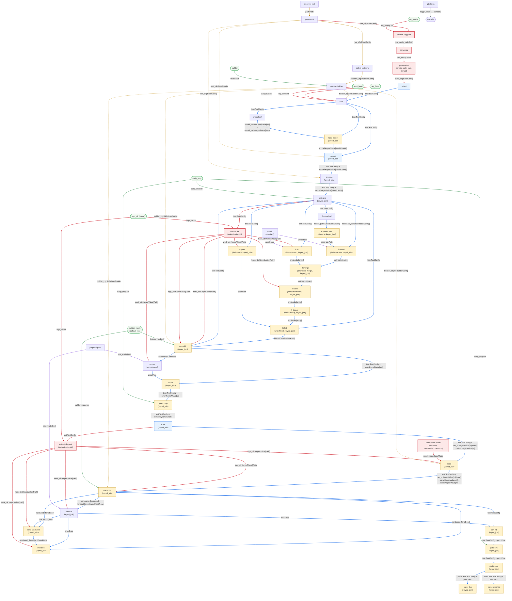

# Overview

## Goal

Port `rtl_buddy`'s `do_rtl_regression` command as a sibling `rtl-comrade` graph, derived from the existing `test` graph (`graphs/test.yaml`). This is the larger of the two sibling ports — multiple suites, per-suite working directories, level filtering, and a streaming suite pipeline all interact with the existing test graph's persistent-input wiring.

> **Baseline.** This plan depends on the completed `test` graph and all modules in `modules/rtl_buddy/`. The pinned rtl_buddy version and the `Compatibility source:` citation rules are those of [implementation-test's overview](../implementation-test/00-overview.md#goal).

## Why a sibling graph

`regression` differs from `test` in five ways:

1. **Suite pipeline.** `test` reads one suite config from the CLI. `regression` reads a `regressions.yaml` listing N suite configs, resolves each path, and streams them into `parse-suite-config` under a `default` contract (not `unit`).
2. **Per-suite `work_dir` and `logs_dir`.** `test` emits `Path.cwd().resolve()` once via `work-dir` and fans it out as a persistent input. Regression has no single CWD — each suite's working directory is `suite_dir` from `parse-suite-config`. Two `ExtractSuiteDirMod` instances (pre- and post-fan-out) replace `work-dir` and `ensure-logs`.
3. **Suite-key prefixing.** The correlation key becomes `<suite>/<test>#<sweep>#<run>` to distinguish same-named tests across suites and group the summary table by suite.
4. **Seed mode.** Always `SeedMode.DEFAULT` — no `--rnd-new`/`--rnd-last` CLI flags. A `constant` node replaces `derive-seed-mode`.
5. **No list mode.** The `route-list` / `list-names` / `list` CLI edge set is absent.

Everything else carries over unchanged — setup chain (minus `work-dir` and `ensure-logs`), selection/expansion, filelist pipeline, compile, sim, post, logging.

## Full graph

The full dataflow of the `regression` graph. Colour key: solid blue = main line, amber dashed = persistent config, purple = env, green = CLI inputs, red = delta nodes/edges (new or rewired vs `test.yaml`).



## Graph delta summary

### Nodes removed (vs `test.yaml`)

| ID | Module | Reason |
|---|---|---|
| `seed-mode` | `derive-seed-mode` | Replaced by `const-seed-mode` |
| `route-list` | `flag-gate` | No list mode in regression |
| `list-names` | `list-test-names` | No list mode in regression |
| `work-dir` | `work-dir` | Per-suite `suite_dir` replaces global CWD |
| `ensure-logs` | `ensure-logs-dir` | Absorbed by `extract-dir` / `extract-dir-post` |

### Nodes added

| ID | Module | Contract |
|---|---|---|
| `resolve-reg-path` | `resolve-reg-config-path` | `unit` |
| `parse-reg` | `parse-reg-config` | `default` |
| `const-seed-mode` | `constant` (config: `SeedMode.DEFAULT`) | `default` |
| `extract-dir` | `extract-suite-dir` | `{ name: default, config: { persistent_inputs: [logs_dir] } }` |
| `extract-dir-post` | `extract-suite-dir` | `{ name: default, config: { persistent_inputs: [logs_dir] } }` |

### Nodes changed

| ID | Change |
|---|---|
| `parse-suite` | Contract switches from `unit` to `default`; config adds `prefix_suite: true` |
| `cc-build` | Remove `work_dir` and `logs_dir` from `persistent_inputs` |
| `cc-run` | Remove `work_dir` from `persistent_inputs` |
| `sim-build` | Remove `logs_dir` from `persistent_inputs` |
| `seed` | Remove `logs_dir` from `persistent_inputs` |
| `sim-run` | Remove `work_dir` from `persistent_inputs` |
| `randseed` | Remove `work_dir` from `persistent_inputs` |
| `link-latest` | Remove `work_dir` from `persistent_inputs` |
| `fl-tb` | Remove `base_dir` from `persistent_inputs` |
| `fl-norm` | Remove `base_dir` from `persistent_inputs` |
| `fl-path` | Remove `work_dir` from `persistent_inputs` |

### Edges removed

```yaml
# seed-mode
- { src: { cli: rnd_new, ... },  dst: { node: seed-mode, port: rnd_new } }
- { src: { cli: rnd_last, ... }, dst: { node: seed-mode, port: rnd_last } }
- { src: { node: seed-mode },    dst: { node: seed, port: seed_mode } }

# list-mode
- { src: { cli: list, ... },              dst: { node: route-list, port: flag } }
- { src: { node: parse-suite },           dst: { node: route-list, port: value } }
- { src: { node: route-list, port: "on" },  dst: { node: list-names, port: suite_cfg } }
- { src: { node: route-list, port: "off" }, dst: { node: select, port: suite_cfg } }

# test_name, test_config CLI edges
- { src: { cli: test_name, ... }, dst: { node: select, port: test_name } }
- { src: { cli: test_config, ... }, dst: { node: parse-suite, port: test_config } }

# work-dir fan-out (all edges from work-dir node)
- { src: { node: work-dir }, dst: { node: ensure-logs, port: work_dir } }
- { src: { node: work-dir }, dst: { node: cc-build,    port: work_dir } }
- { src: { node: work-dir }, dst: { node: cc-run,      port: work_dir } }
- { src: { node: work-dir }, dst: { node: sim-run,     port: work_dir } }
- { src: { node: work-dir }, dst: { node: randseed,    port: work_dir } }
- { src: { node: work-dir }, dst: { node: link-latest, port: work_dir } }
- { src: { node: work-dir }, dst: { node: fl-tb,       port: base_dir } }
- { src: { node: work-dir }, dst: { node: fl-norm,     port: base_dir } }
- { src: { node: work-dir }, dst: { node: fl-path,     port: work_dir } }

# ensure-logs (node removed; role absorbed by extract-dir)
- { src: { cli: logs_dir, ... },             dst: { node: ensure-logs, port: logs_dir } }
- { src: { node: ensure-logs, port: logs_dir }, dst: { node: cc-build,  port: logs_dir } }
- { src: { node: ensure-logs, port: logs_dir }, dst: { node: sim-build, port: logs_dir } }
- { src: { node: ensure-logs, port: logs_dir }, dst: { node: seed,      port: logs_dir } }
```

### Edges added

**Suite stream:**

```yaml
- { src: { cli: reg_config, type: str, default: "" }, dst: { node: resolve-reg-path, port: reg_config } }
- { src: { node: parse-root },       dst: { node: resolve-reg-path, port: root_cfg } }
- { src: { node: resolve-reg-path }, dst: { node: parse-reg,        port: reg_config_path } }
- { src: { node: parse-reg },        dst: { node: parse-suite,      port: test_config } }
- { src: { node: parse-suite },      dst: { node: select,           port: suite_cfg } }
```

**Level filtering:**

```yaml
- { src: { cli: reg_level,   type: int, default: 0 }, dst: { node: filter, port: reg_level } }
- { src: { cli: start_level, type: int, default: 0 }, dst: { node: filter, port: start_level } }
```

**Seed mode:**

```yaml
- { src: { node: const-seed-mode }, dst: { node: seed, port: seed_mode } }
```

**`extract-dir` — pre-fan-out:**

```yaml
- { src: { node: gate-pre, port: test }, dst: { node: extract-dir, port: test } }
- { src: { cli: logs_dir, type: str, default: "logs" }, dst: { node: extract-dir, port: logs_dir } }
- { src: { node: extract-dir, port: work_dir }, dst: { node: cc-build, port: work_dir } }
- { src: { node: extract-dir, port: work_dir }, dst: { node: cc-run,   port: work_dir } }
- { src: { node: extract-dir, port: base_dir }, dst: { node: fl-tb,    port: base_dir } }
- { src: { node: extract-dir, port: base_dir }, dst: { node: fl-norm,  port: base_dir } }
- { src: { node: extract-dir, port: work_dir }, dst: { node: fl-path,  port: work_dir } }
- { src: { node: extract-dir, port: logs_dir }, dst: { node: cc-build, port: logs_dir } }
```

**`extract-dir-post` — post-fan-out:**

```yaml
- { src: { node: runs, port: test },   dst: { node: extract-dir-post, port: test } }
- { src: { cli: logs_dir, type: str, default: "logs" }, dst: { node: extract-dir-post, port: logs_dir } }
- { src: { node: extract-dir-post, port: work_dir }, dst: { node: sim-run,     port: work_dir } }
- { src: { node: extract-dir-post, port: work_dir }, dst: { node: randseed,    port: work_dir } }
- { src: { node: extract-dir-post, port: work_dir }, dst: { node: link-latest, port: work_dir } }
- { src: { node: extract-dir-post, port: logs_dir }, dst: { node: sim-build, port: logs_dir } }
- { src: { node: extract-dir-post, port: logs_dir }, dst: { node: seed,      port: logs_dir } }
```

### Everything else

All of the following carry over unchanged from `test.yaml`:

- setup chain: `discover-root`, `prepend-path`, `parse-root`, `select-platform`, `resolve-builder`, `git-status` (`work-dir` and `ensure-logs` are removed — absorbed by `extract-dir`)
- selection / expansion: `select`, `filter`, `model-ref`, `load-model`, `sweep`
- per-test prep: `preproc`, `gate-pre`
- filelist pipeline: `unroll`, `fl-model-ref`, `fl-model-root`, `fl-model`, `fl-tb`, `fl-merge`, `fl-norm`, `fl-dedup`, `fl-path`, `filelist` (contract configs change for `fl-tb`, `fl-norm`, `fl-path` per above)
- compile: `cc-build`, `cc-run`, `cc-int`, `gate-comp` (contract configs change for `cc-build`, `cc-run` — `work_dir` and `logs_dir` move from persistent to keyed)
- sim: `runs`, `seed`, `sim-build`, `sim-run`, `randseed`, `link-latest`, `sim-int`, `gate-sim` (contract configs change for `sim-run`, `randseed`, `link-latest` — `work_dir` keyed; `sim-build`, `seed` — `logs_dir` keyed)
- post: `route-post`, `parse-log`, `parse-uvm-log`
- `logging:` block (both summary processors)
- all `env_ready`, `builder_cfg`, `root_cfg` fan-out edges

## CLI surface

Matching rtl_buddy's `do_rtl_regression` signature.

| arg | flag | type | default | destination |
|---|---|---|---|---|
| `reg_config` | `-c/--reg-config` | str | `""` | `resolve-reg-path.reg_config` |
| `reg_level` | `-l/--reg-level` | int | 0 | `filter.reg_level` |
| `start_level` | `-s/--start-level` | int | 0 | `filter.start_level` |
| `logs_dir` | `--logs-dir` | str | `logs` | `extract-dir.logs_dir`, `extract-dir-post.logs_dir` |
| `builder` | `--builder` | str | `""` | `resolve-builder.builder` |
| `builder_mode` | `-M/--builder-mode` | str | **`reg`** | `cc-build.builder_mode`, `sim-build.builder_mode` |
| `early_stop` | `--early-stop` | str | `post` | `gate-pre`, `gate-comp`, `gate-sim` |

**Removed from test:** `test_name`, `list`, `rnd_new`, `rnd_last`, `test_config`.

**Changed from test:** `builder_mode` default changes from `"debug"` to `"reg"`.

## Structural notes

### Early-stop / skip row count

`gate-pre`/`gate-comp` sit before the `runs` fan-out, so a pre/comp early-stop or a level skip emits one summary row per test, not R duplicate rows.

### No process-wide `chdir`

No node calls `os.chdir`. Each compile/sim subprocess runs with `cwd=work_dir` via `RunProcessMod`'s `cwd=work_dir` parameter. Concurrent suites' tests can run with different `work_dir`s without racing a shared process CWD.

### Summary aggregation

The `ConsoleSummaryProcessor` and `FileSummaryProcessor` logging plugins match diagnostic log events by name, accumulate one row per test, and render the table at end of run. With the suite name stamped into the correlation key at `parse-suite-config` (`<suite>/<test>#<sweep>#<run>`, via `prefix_suite: true`), every row carries its suite. The table groups naturally on that prefix. No plugin change needed.

### Pre/post fan-out key mismatch

`expand-runs` re-keys everything from `test_key` to `test_key#run_id`. A keyed `work_dir` emitted with `test_key` won't match `test_key#run_id` in `keyed_join` on post-fan-out nodes. Since `TestConfig.suite_dir` rides the object through the fan-out, the solution is two `ExtractSuiteDirMod` instances — one before and one after `expand-runs`:

- **`extract-dir`** (after `gate-pre`): emits with key `test_key`, serves pre-fan-out consumers.
- **`extract-dir-post`** (after `runs`): receives the re-keyed `test` from `expand-runs`, emits with key `test_key#run_id`, serves post-fan-out consumers.

## Acceptance criteria

- All new module unit tests pass.
- `graphs/regression.yaml` loads without structural validation errors at startup.
- The `regression` subcommand appears in `rtl-comrade --help`.
- A basic `regression` run against the fixture project:
  - creates per-suite `logs/` directories under each suite's directory
  - runs all suites' tests
  - produces a summary table with suite-prefixed keys
  - returns exit code 0 when all tests pass
- Level filtering correctly includes/excludes tests based on `reg_level` and `start_level`.
- `builder_mode` defaults to `"reg"`, not `"debug"`.
- The `parse-suite-config` module remains contract-agnostic and backwards-compatible: existing test and randtest graphs (no `config` block, `prefix_suite` defaults to `False`) are unaffected.

## Settled decisions

1. **Per-suite `work_dir` and `logs_dir` routing:** `ExtractSuiteDirMod` extracts `test.suite_dir` per test and emits keyed `work_dir`, `base_dir`, and `logs_dir` values. Two instances: `extract-dir` (pre-fan-out, key = `test_key`) and `extract-dir-post` (post-fan-out, key = `test_key#run_id`). Downstream nodes move `work_dir`/`base_dir`/`logs_dir` from `persistent_inputs` to regular keyed inputs. No downstream module changes — only graph-YAML contract configs.

2. **Suite-key prefixing:** config flag (`prefix_suite: true`) on `ParseSuiteConfigMod`. No separate `stamp-suite-key` module. The key becomes `<suite_dir.name>/<test_name>` at construction time. Same leaf-name collision behaviour as rtl_buddy.

3. **`ensure-logs` removal:** `ensure-logs` is dropped from the regression graph. Its role (create the logs directory, emit resolved `logs_dir` Path) is absorbed by `ExtractSuiteDirMod`, which creates `suite_dir / logs_dir` and emits the resolved path as a keyed value. Per-test `mkdir -p` is idempotent.
