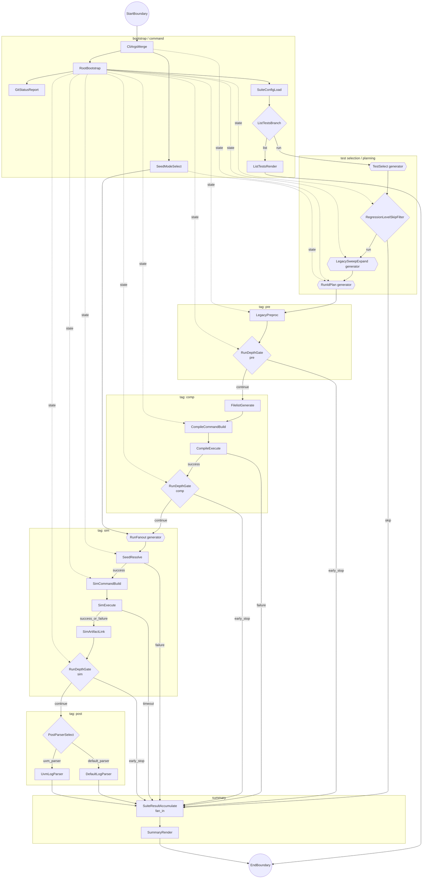

# rtl-comrade `test` Compatibility Graph: Module-by-Module Implementation Plan

## 1. Purpose

This plan decomposes the `rtl_buddy v1.4.0` `test` command into a modular `rtl-comrade` graph. The goal is not to wrap the legacy `TestRunner` or `VlogSim` as one large node, but to preserve observable behavior while exposing the existing stages as graph nodes connected by typed artefacts.

The graph should preserve the `rtl_buddy test` compatibility contract:

- load root config, builder selection, and suite config before running tests;
- support `--list` as a graph branch that exits before execution;
- select one or all tests from `tests.yaml`;
- support regression-level skip gates even though the plain `test` command normally leaves those bounds unset;
- run sweep expansion before per-run execution;
- run pre-processing once per expanded test;
- compile once per expanded test;
- execute simulation once per run id;
- post-process once per completed simulation;
- preserve early-stop behavior at `pre`, `comp`, and `sim` depths;
- preserve result vocabulary and exit-code behavior.

## 2. Source reference map

The following references are to `expedera-sg/rtl_buddy` at tag `v1.4.0`. They are included as implementation anchors for compatibility work.

| Area | Source lines |
|---|---|
| Typer command registration and root option flow | `src/rtl_buddy/rtl_buddy.py:L74-L154` |
| `test` command CLI parameters, suite loading, `--list`, seed mode, summary, exit code | `src/rtl_buddy/rtl_buddy.py:L156-L204` |
| skip result helper, sweep expansion, runner construction, suite iteration | `src/rtl_buddy/rtl_buddy.py:L237-L342` |
| `RunDepth`, single-run flow, multi-run flow | `src/rtl_buddy/runner/test_runner.py:L10-L122` |
| result vocabulary and pass/skip exit semantics | `src/rtl_buddy/runner/test_results.py:L10-L78` |
| root config discovery, platform/builder selection | `src/rtl_buddy/config/root.py:L12-L113` |
| suite config loading and test lookup | `src/rtl_buddy/config/suite.py:L8-L70` |
| `TestConfig`, plusargs, plusdefines, timeout, sweep/preproc/postproc paths, reglvl, initialization | `src/rtl_buddy/config/test.py:L7-L264` |
| `VlogSim` construction, output/log path helpers, filelist, plusargs, plusdefines | `src/rtl_buddy/tools/vlog_sim.py:L26-L119` |
| legacy preproc hook | `src/rtl_buddy/tools/vlog_sim.py:L121-L141` |
| compile command build and execution | `src/rtl_buddy/tools/vlog_sim.py:L143-L190` |
| simulation command, seed resolution, timeout, logs, symlinks | `src/rtl_buddy/tools/vlog_sim.py:L192-L285` |
| post parser selection | `src/rtl_buddy/tools/vlog_sim.py:L287-L303` |
| default and UVM post-processing | `src/rtl_buddy/tools/vlog_post.py:L12-L80` |
| filelist extraction, processing, and `run.f` writing | `src/rtl_buddy/tools/vlog_filelist.py:L15-L145` |

## 3. Graph and harness constraints

`rtl-comrade` modules should remain node-local and should not own graph scheduling policy. Contracts decide when a node runs, which payloads are supplied for an invocation, and when a node terminates. The implementation plan therefore separates module logic from contracts and graph wiring.

The graph should use current `rtl-comrade` conventions:

- module `run(...)` parameters define input ports;
- returning a plain value emits on `default`;
- returning or yielding `(port_name, value)` emits on a named port;
- node config is passed through `Config` when present;
- one destination input currently has at most one upstream source;
- source ports must be statically valid when possible;
- acyclic graph validation should reject malformed wiring before runtime.

## 4. Core artefacts

Implement these artefacts as serde-compatible dataclasses in a shared core module package, for example `modules/rtl_buddy_compat/artefacts.py`.

### `TestCliArgs`

Fields:

- `test_config: str = "tests.yaml"`
- `test_name: str | None`
- `list_tests: bool`
- `rnd_new: bool | None`
- `rnd_last: bool | None`
- `rtl_builder_mode: str | None`
- `builder_override: str | None`
- `run_depth: str`
- `debug: bool`
- `color: bool`

Compatibility source: `do_cmd_test(...)` arguments and root callback options in `rtl_buddy.py:L110-L204`.

### `RootContext`

Fields:

- `root_cfg`: serialized or compatibility-wrapped root config payload;
- `builder_name: str`;
- `rtl_builder_mode: str`;
- `run_depth: str`;
- `project_root: str`;
- `root_config_path: str`.

Compatibility source: `RootConfig` initialization and getter behavior in `root.py:L46-L201`, plus defaulting builder mode to `debug` in `rtl_buddy.py:L171-L172`.

### `SuiteContext`

Fields:

- `path: str`;
- `test_names: list[str]`;
- `tests: list[TestConfigEnvelope]`.

Compatibility source: `SuiteConfig` parsing, `get_tests`, and `get_test_names` in `suite.py:L13-L62`.

### `TestConfigEnvelope`

Fields:

- `name: str`;
- `desc: str`;
- `model`;
- `testbench`;
- `reglvl`;
- `plusargs`;
- `plusdefines`;
- `uvm`;
- `preproc_path`;
- `postproc_path`;
- `sweep_path`;
- `timeout`.

Compatibility source: `TestConfig` and `TestConfigFile.initialise(...)` in `test.py:L30-L264`.

### `TestInstanceKey`

Fields:

- `suite_path: str`;
- `original_test_name: str`;
- `expanded_test_name: str`;
- `expanded_index: int`;
- `run_id: int | None`.

This is a new graph correlation key. It is not a legacy object, but it preserves the result-row shape built by `_append_results(...)` and `_append_skip_results(...)` in `rtl_buddy.py:L237-L289`.

### `SeedModePlan`

Fields:

- `mode: Literal["default", "new", "replay"]`;
- `replay_run_id: int | None`.

Compatibility source: seed-mode selection in `rtl_buddy.py:L184-L190` and execution seed handling in `vlog_sim.py:L211-L245`.

### `FilelistArtefact`

Fields:

- `output_path: str`;
- `lines: list[str]`;
- `run_plan: PreprocessedRunPlan`.

The `run_plan` field carries forward the full preprocessed run plan so that `CompileCommandBuild` only needs `filelist` and `root` as inputs — it does not need a separate edge from `FilelistGenerate`'s upstream. This keeps `CompileCommandBuild` to two input ports (one trigger, one state).

### `CompileCommand`

Fields:

- `argv: list[str]`;
- `cwd: str`;
- `test_name: str`;
- `build_dir: str`;
- `filelist_path: str`;
- `run_plan: PreprocessedRunPlan`.

The `run_plan` is forwarded so `RunDepthGateComp` and `RunFanout` have access to the full test context without additional upstream edges.

Compatibility source: compile command construction in `vlog_sim.py:L143-L166`.

### `SimCommand`

Fields:

- `argv: list[str]`;
- `cwd: str`;
- `test_name: str`;
- `run_id: int | None`;
- `log_path_prefix: str`;
- `timeout_seconds: int`;
- `seed: int`.

Compatibility source: simulator path, log path, timeout, seed, plusargs, plusdefines in `vlog_sim.py:L73-L86` and `vlog_sim.py:L192-L285`.

### `TestResultRow`

Fields:

- `key: TestInstanceKey`;
- `result: Literal["PASS", "FAIL", "NA", "SKIP"]`;
- `desc: str`;
- `evidence: dict[str, str]`.

Compatibility source: result classes and `is_pass()` in `test_results.py:L10-L78`.

## 5. Contracts to implement or reuse

### 5.1 `DefaultContract`

Use current built-in default behavior for one-shot modules and modules where every required input should trigger exactly one invocation.

### 5.2 `ZipContract`

Use the checked-in `zip` contract where all input ports emit exactly once and a single paired invocation is required. Appropriate for bootstrap nodes where both `cli` and `root` arrive once and the module runs once to consume both.

### 5.3 Generator `run()` pattern (no new contract)

Nodes that need to emit multiple items from a single invocation — test selection, sweep expansion, run-id fanout — use a generator `run(...)`. The module `yield`s one item per output. No `FanoutContract` is needed; the existing harness already drives generator modules to completion before the node terminates.

Affected modules: `TestSelect`, `LegacySweepExpand`, `RunIdPlan`, `RunFanout`.

### 5.4 Named-port routing (no new contract)

Nodes that need to route a payload to one of two downstream paths emit `("port_name", value)` tuples. Downstream nodes connect only to the port they care about. The harness already supports this; no `BranchContract` is needed.

Affected modules: `ListTestsBranch`, `RegressionLevelSkipFilter`, `RunDepthGate` (three instances — see §6.13), `CompileExecute`, `SeedResolve`, `SimExecute`, `PostParserSelect`.

### 5.5 `FanInContract`

Implement. This contract supports streaming fan-in across N named input ports while respecting the single-source-per-port constraint.

Behavior:

- accepts N named input ports, each with exactly one upstream source;
- when any port delivers an item, the contract immediately invokes `module.run(item=<value>)` with that single item via a synthetic `"item"` port;
- when a port delivers `EndSentinel`, that port is marked done and no longer polled;
- when all N ports have delivered `EndSentinel`, the contract returns `EndSentinel` and the node terminates.

Accumulation is the module's responsibility (via instance state). The contract delivers items one at a time and tracks termination — it does not batch.

File: `contracts/fan_in.py`. Registered as `fan_in` in `contracts/config.yaml`.

## 6. Module implementation plan

Each module below should be implemented as a plain Python class with `run(...)`. Node-local configuration goes in a nested `Config` class only when it is graph-specific. Scheduling policy belongs in graph contracts, not in module code.

---

## 6.1 `CliArgsMerge`

### Role

Collect individually-typed CLI argument values (arriving via CLI edges in the graph YAML) and assemble them into one `TestCliArgs` artefact.

### Inputs

One port per `TestCliArgs` field, each sourced by a CLI edge:
`test_config`, `test_name`, `list_tests`, `rnd_new`, `rnd_last`,
`rtl_builder_mode`, `builder_override`, `run_depth`, `debug`, `color`.

### Outputs

- `default`: `TestCliArgs`

### Contract

`zip` — fires once when all ten CLI edge values have arrived.

### Implementation steps

1. Define `run(self, test_config, list_tests, ...)` with one parameter per CLI arg (no `Config` class).
2. Assemble and return `TestCliArgs(...)` from the received values.

### Compatibility references

- `rtl_buddy.py:L110-L154`: root-level CLI options.
- `rtl_buddy.py:L156-L169`: `test` command arguments and defaults.

### Acceptance checks

- Default `test_config` is `tests.yaml` (declared in the CLI edge, not in a Config).
- Default `run_depth` is `post`.
- `test_name` may be absent (CLI edge declares `default: null`).
- `rnd_new` and `rnd_last` may both be false.

---

## 6.2 `RootBootstrap`

### Role

Discover and load `root_config.yaml`, select the platform builder, apply builder override, and choose the effective builder mode.

### Inputs

- `cli: TestCliArgs`

### Outputs

- `default`: `RootContext`

### Contract

`unit` — reads exactly one `cli` item and runs once.

### Implementation steps

1. Port root discovery from `_discover_root_cfg(...)`.
2. Load root config through the existing or ported serde schema.
3. Apply `builder_override` before platform builder selection.
4. Select platform by `uname`.
5. Set `rtl_builder_mode` to `cli.rtl_builder_mode or "debug"` for the `test` graph.
6. Carry through `run_depth`.

### Compatibility references

- `root.py:L12-L31`: root config discovery.
- `root.py:L46-L113`: root config load and platform/builder selection.
- `rtl_buddy.py:L171-L172`: `test` defaults builder mode to `debug`.

### Acceptance checks

- Missing `root_config.yaml` is fatal.
- Unknown platform is fatal.
- Builder override uses configured builder names only.
- Effective builder mode is `debug` unless overridden.

---

## 6.3 `GitStatusReport`

### Role

Emit the git status report that `rtl_buddy` currently prints for test-like commands.

### Inputs

- `cli: TestCliArgs`
- `root: RootContext`

### Outputs

- `default`: `GitStatusArtefact`

### Contract

`zip` — both inputs arrive exactly once; a single paired invocation is sufficient.

### Implementation steps

1. Run `git status -sb` and `git log -1 --pretty=%h` in the current working directory.
2. Format branch, commit, modified count, staged count, and cleanliness.
3. Emit the result as observability payload rather than coupling it to execution.

### Compatibility references

- `rtl_buddy.py:L117-L120`: git status is shown for test-like invocations except `test --list`.
- `rtl_buddy.py:L421-L449`: current git status implementation.

### Acceptance checks

- `test --list` does not emit git status.
- Clean and dirty worktrees produce compatible text.

---

## 6.4 `SuiteConfigLoad`

### Role

Load `tests.yaml`, construct the testbench lookup, initialize tests, and expose the test index.

### Inputs

- `cli: TestCliArgs`
- `root: RootContext`

### Outputs

- `default`: `SuiteContext`

### Contract

`zip` — both inputs arrive exactly once; a single paired invocation is sufficient.

### Implementation steps

1. Open `cli.test_config`.
2. Deserialize `SuiteConfigFile`.
3. Build `testbench_name -> TestbenchConfig`.
4. For each `TestConfigFile`, resolve its `model_path` relative to the suite config directory.
5. Store test names in declaration order.

### Compatibility references

- `suite.py:L8-L39`: suite deserialization, testbench lookup, and test initialization.
- `test.py:L247-L264`: per-test model/testbench initialization.

### Acceptance checks

- Malformed testbench section is fatal.
- Missing requested testbench is fatal.
- Test declaration order is preserved for `--list` and all-test execution.

---

## 6.5 `ListTestsBranch`

### Role

Route suite loading into either `--list` rendering or normal execution.

### Inputs

- `cli: TestCliArgs`
- `suite: SuiteContext`

### Outputs

- `list`: `SuiteContext`
- `run`: `SuiteContext`

### Contract

`zip` — both inputs arrive exactly once; a single paired invocation determines the route.

### Implementation steps

1. Check `cli.list_tests`.
2. Emit the suite context on `list` if true.
3. Emit the suite context on `run` if false.

### Compatibility references

- `rtl_buddy.py:L174-L176`: list test names and exit.
- `suite.py:L57-L62`: `get_test_names()` behavior.

### Acceptance checks

- `--list` stops before test selection, sweep, preproc, compile, sim, or post.
- Output uses two spaces between names, matching `"  ".join(...)`.

---

## 6.6 `ListTestsRender`

### Role

Render the `--list` output.

### Inputs

- `suite: SuiteContext`

### Outputs

- `default`: `RenderedOutput`

### Contract

`unit` — receives the single `SuiteContext` from the `list` port of `ListTestsBranch` and runs once.

### Implementation steps

1. Join `suite.test_names` with two spaces.
2. Emit rendered output for stdout.

### Compatibility references

- `rtl_buddy.py:L174-L176`: current render and exit behavior.

### Acceptance checks

- No git status for `test --list`.
- Exit code is `0`.

---

## 6.7 `SeedModeSelect`

### Role

Convert seed-related CLI flags into a normalized `SeedModePlan`.

### Inputs

- `cli: TestCliArgs`

### Outputs

- `default`: `SeedModePlan`

### Contract

`unit` — receives one `cli` item and runs once.

### Implementation steps

1. If `rnd_new` is true, emit `mode="new"`.
2. Else if `rnd_last` is true, emit `mode="replay"`.
3. Else emit `mode="default"`.
4. Set `replay_run_id=None` for plain `test`.

### Compatibility references

- `rtl_buddy.py:L184-L190`: seed mode priority.
- `vlog_sim.py:L211-L245`: seed behavior during simulation.

### Acceptance checks

- `rnd_new` wins if both `rnd_new` and `rnd_last` are true.
- Default mode uses builder-config seed later.

---

## 6.8 `TestSelect`

### Role

Select either the requested test or all tests from the suite.

### Inputs

- `cli: TestCliArgs`
- `suite: SuiteContext`

### Outputs

- `default`: stream of `TestConfigEnvelope` (one per selected test)

### Contract

`zip` — both inputs arrive exactly once. `run(...)` is a **generator** that yields one `TestConfigEnvelope` per selected test. The harness drives the generator to completion before the node terminates, emitting one item per yield into the downstream pipeline.

### Implementation steps

1. If `cli.test_name` is set, find exactly that test by name.
2. If absent, yield all tests in declaration order.
3. Emit fatal error if a named test does not exist.

### Compatibility references

- `suite.py:L41-L55`: `get_tests(test_name)` semantics.
- `rtl_buddy.py:L292-L342`: `_do_test_suite(...)` iterates over selected tests.

### Acceptance checks

- Missing named test is fatal.
- All-test mode preserves suite order.

---

## 6.9 `RegressionLevelSkipFilter`

### Role

Apply regression-level start/end gates before sweep expansion.

### Inputs

- `test: TestConfigEnvelope`
- `root: RootContext`
- optional `reg_level: int | None`
- optional `start_level: int | None`
- `run_ids: list[int | None]`

### Outputs

- `run`: `TestConfigEnvelope`
- `skip`: `TestResultRow`

### Contract

`latest` with `trigger_ports: [test]` — `root` is a state port read once and cached. Each arrival on `test` triggers one invocation.

### Implementation steps

1. Resolve `t_lvl = test.get_reglvl(root.builder_name)`.
2. If `reg_level is not None and t_lvl > reg_level`, emit one `SKIP` row for each run id.
3. Else if `start_level is not None and t_lvl < start_level`, emit one `SKIP` row for each run id.
4. Else emit the test on the `run` port.

### Compatibility references

- `test.py:L211-L240`: builder-specific `reglvl` resolution.
- `rtl_buddy.py:L306-L321`: skip conditions.
- `rtl_buddy.py:L237-L241`: skipped tests expand to one row per run id.

### Acceptance checks

- Skipped tests do not enter sweep, preproc, compile, sim, or post.
- `SKIP` rows preserve run-id cardinality.
- `SKIP` is pass-like for exit-code accumulation.

---

## 6.10 `LegacySweepExpand`

### Role

Run legacy sweep scripts and emit expanded test configs.

### Inputs

- `test: TestConfigEnvelope`
- `root: RootContext`

### Outputs

- `default`: stream of `TestConfigEnvelope` (one per expanded variant)

### Contract

`latest` with `trigger_ports: [test]` — `root` is a state port. `run(...)` is a **generator**. For each incoming `test`, the generator yields one or more expanded variants. If there is no sweep script, it yields the original `test` unchanged.

### Implementation steps

1. If `test.sweep_path is None`, yield `test`.
2. Otherwise read the Python script.
3. Execute it with namespace values compatible with v1.4.0: `logger`, `TestConfig`, `test_cfg`, `root_cfg`, and `out_test_cfgs`.
4. Yield each item from `out_test_cfgs`.
5. Treat exceptions as fatal or as a compatibility failure according to the graph failure policy.

### Compatibility references

- `test.py:L201-L209`: `get_sweep_path()`.
- `rtl_buddy.py:L243-L262`: sweep script execution namespace and output list.
- `rtl_buddy.py:L322-L331`: sweep expansion occurs before runner construction.

### Acceptance checks

- No sweep script emits the original test unchanged.
- Sweep script expansion can mutate or produce new `TestConfig`-compatible objects.
- Sweep runs before preproc and compile.

---

## 6.11 `RunIdPlan`

### Role

Create the run-id plan for the selected invocation.

### Inputs

- `expanded_test: TestConfigEnvelope`
- `cli: TestCliArgs`
- `seed_mode: SeedModePlan`

### Outputs

- `default`: stream of `RunPlan` (one per run id)

### Contract

`latest` with `trigger_ports: [expanded_test]` — `cli` and `seed_mode` are state ports read once and cached. `run(...)` is a **generator** that yields one `RunPlan` per run id. For plain `test`, this is exactly one yield with `run_id=None`.

### Implementation steps

1. For plain `test`, set `run_ids=[None]`.
2. Construct `TestInstanceKey` values for each run id.
3. Yield one `RunPlan` per run id.

### Compatibility references

- `rtl_buddy.py:L181-L191`: plain `test` uses `run_ids = [None]`.
- `test_runner.py:L83-L122`: multi-run path compiles once and loops over run ids.

### Acceptance checks

- Normal `test` emits exactly one run id: `None`.
- Graph remains compatible with future `randtest` by keeping run ids explicit.

---

## 6.12 `LegacyPreproc`

### Role

Run the legacy preproc hook once per expanded test before filelist generation and compile.

### Inputs

- `root: RootContext`
- `run_plan: RunPlan`

### Outputs

- `default`: `PreprocessedRunPlan`

### Contract

`latest` with `trigger_ports: [run_plan]` — `root` is a state port.

### Implementation steps

1. Read `test.preproc_path`.
2. If absent, emit the input unchanged.
3. If present, execute the script with `logger`, `test_cfg`, and `root_cfg`.
4. Allow the script to mutate `test_cfg` before downstream modules consume plusargs/plusdefines/filelist/timeout.

### Compatibility references

- `test.py:L191-L199`: `get_preproc_path()`.
- `vlog_sim.py:L121-L141`: preproc script execution namespace and mutation behavior.
- `test_runner.py:L56-L60`: preproc runs before early-stop PRE gate and compile.

### Acceptance checks

- Preproc runs once per expanded test, not once per run id.
- Preproc mutations are visible to filelist, compile, sim, and post modules.
- Missing preproc is not a failure.

---

## 6.13 `RunDepthGate`

### Role

Generic early-stop gate. One Python class, three graph instances. Each instance configures `gate_depth` to specify which run-depth value triggers the stop. The same module handles all three positions in the pipeline (post-preproc, post-compile, post-sim).

### Config

- `gate_depth: str` — one of `"pre"`, `"comp"`, `"sim"`; compared against `root.run_depth`
- `stop_desc: str` — description string placed in the `TestResultRow` on early stop; should match the legacy `EarlyStopResults` desc for the corresponding depth

### Inputs

- `root: RootContext`
- `payload` — the artefact to pass through or stop; type varies per graph instance (see instances table below)

### Outputs

- `continue`: same type as `payload`
- `early_stop`: `TestResultRow`

### Contract

`latest` with `trigger_ports: [payload]` — `root` is a state port. The port name `payload` is used for all three instances; the upstream edge targets this port by name in the graph YAML.

### Implementation steps

1. Check `root.run_depth == config.gate_depth`.
2. If so, construct a `TestResultRow` with `result="NA"`, `desc=config.stop_desc`, and `key` extracted from `payload.instance_key`. Emit on `early_stop`.
3. Otherwise emit `payload` unchanged on `continue`.

Note: `PreprocessedRunPlan`, `CompileResult`, and `LinkedSimArtifacts` must each expose an `.instance_key: TestInstanceKey` property so the gate can construct the result row without type-specific logic.

### Graph instances

| Node ID | `gate_depth` | `stop_desc` | `payload` type |
|---|---|---|---|
| `run-depth-gate-pre` | `pre` | `"Stopped early at preproc"` | `PreprocessedRunPlan` |
| `run-depth-gate-comp` | `comp` | `"Stopped early at compile"` | `CompileResult` |
| `run-depth-gate-sim` | `sim` | `"Stopped early at sim"` | `LinkedSimArtifacts` |

### Compatibility references

- `test_runner.py:L58-L61`: `RunDepth.PRE` → `EarlyStopResults(desc="Stopped early at preproc")`.
- `test_runner.py:L68-L70`: `RunDepth.COMP` early-stop behavior.
- `test_runner.py:L77-L79`: `RunDepth.SIM` early-stop behavior.
- `test_results.py:L50-L57`: early-stop result shape.

### Acceptance checks

- Each instance stops the pipeline only when `run_depth` matches its configured `gate_depth`.
- An instance with a non-matching `gate_depth` passes the payload through unchanged.
- `NA` rows flow to `suite-accumulate` via the `early_stop` port.
- Stages downstream of a triggered gate do not run.

---

## 6.14 `FilelistGenerate`

### Role

Generate `run.f` for compile.

### Inputs

- `preprocessed: PreprocessedRunPlan`

### Outputs

- `default`: `FilelistArtefact`

### Contract

`default` — one invocation per incoming `preprocessed` item.

### Implementation steps

1. Build a `VlogFilelist`-compatible object from `test.model` and testbench filelist.
2. Extract model filelist entries.
3. Extract testbench filelist entries if present.
4. Apply compatibility settings: `unroll=True`, `flatten=False`, `strip=False`, `deduplicate=True`.
5. Write `run.f`.
6. Emit `FilelistArtefact` carrying the file path, processed lines, and the original `preprocessed` run plan embedded in the `run_plan` field. This embedding means `CompileCommandBuild` does not need a separate edge from `FilelistGenerate`'s upstream.

### Compatibility references

- `vlog_sim.py:L88-L93`: compile-time filelist write call.
- `vlog_filelist.py:L20-L91`: extraction and `-F` unroll behavior.
- `vlog_filelist.py:L93-L121`: path checks, flatten/strip/deduplicate logic.
- `vlog_filelist.py:L123-L145`: model/testbench merge and output write.

### Acceptance checks

- `-f` inside nested filelists is rejected as in legacy behavior.
- `+libext+` entries consolidate.
- Missing files/dirs produce logged errors matching the intended failure policy.
- `run.f` begins with the legacy generated header.

---

## 6.15 `CompileCommandBuild`

### Role

Build the RTL compile command without executing it.

### Inputs

- `root: RootContext`
- `filelist: FilelistArtefact`

### Outputs

- `default`: `CompileCommand`

### Contract

`latest` with `trigger_ports: [filelist]` — `root` is a state port. The `filelist` artefact carries `run_plan` internally, so no third input edge is required.

### Implementation steps

1. Extract `run_plan` from `filelist.run_plan`.
2. Start with `rtl_builder_cfg.get_exe()`.
3. Append `rtl_builder_cfg.get_compile_time_opts(root.rtl_builder_mode)`.
4. If the builder executable basename starts with `verilator`, append `--Mdir <obj_dir_safe_test_name>`.
5. Append test plusdefines as `+define+KEY` or `+define+KEY=VALUE`.
6. Append `-f run.f`.
7. Emit `CompileCommand`, forwarding `run_plan` in its own `run_plan` field for downstream use.

### Compatibility references

- `vlog_sim.py:L61-L71`: safe test build tag and build directory.
- `vlog_sim.py:L108-L119`: plusdefine construction.
- `vlog_sim.py:L143-L166`: compile command construction.

### Acceptance checks

- Verilator build dir is test-name-safe.
- VCS/non-Verilator builders do not receive `--Mdir`.
- Plusdefines preserve value/no-value distinction.

---

## 6.16 `CompileExecute`

### Role

Run the compile command and normalize compile success/failure.

### Inputs

- `command: CompileCommand`

### Outputs

- `success`: `CompileResult`
- `failure`: `TestResultRow`

### Contract

`default` — one invocation per incoming `command`.

### Implementation steps

1. Run the compile command using `asyncio.create_subprocess_exec` with `stdout=PIPE` and `stderr=PIPE`. Use `await process.communicate()` to collect output without blocking the event loop.
2. On `FileNotFoundError`, emit fatal setup/compiler-not-found failure.
3. Log stdout/stderr like the legacy path.
4. Emit `("success", CompileResult(...))` when return code is zero.
5. Emit `("failure", TestResultRow(...))` with `result="FAIL"` and `desc="compile failed"` when return code is nonzero. Emit one row per planned run id, matching `test_runner.py:L63-L66`.
6. Preserve compile duration as evidence.

### Compatibility references

- `vlog_sim.py:L167-L190`: compile subprocess, return code logging, transient duration print.
- `test_runner.py:L63-L66`: nonzero compile maps to `CompileFailResults`.
- `test_results.py:L42-L48`: compile-fail result shape.

### Acceptance checks

- Compile failure prevents sim and post.
- One compile failure row is emitted per planned run id.
- Return-code and stderr/stdout evidence is preserved.

---

## 6.17 `RunDepthGateComp` (instance of `RunDepthGate`)

Uses the generic `RunDepthGate` module (§6.13) with `gate_depth: comp` and `payload` receiving `CompileResult`. Graph YAML: see `run-depth-gate-comp` in §10.

---

## 6.18 `RunFanout`

### Role

Fan one compile result into one simulation activation per run id.

### Inputs

- `compile_result: CompileResult`
- `seed_mode: SeedModePlan`

### Outputs

- `default`: stream of `PerRunExecutionPlan` (one per run id)

### Contract

`latest` with `trigger_ports: [compile_result]` — `seed_mode` is a state port. `run(...)` is a **generator** that yields one `PerRunExecutionPlan` per run id in the compile result's plan. For plain `test`, this is exactly one yield.

### Implementation steps

1. Iterate over run ids in the compile result.
2. For each run id, yield a `PerRunExecutionPlan` with a full `TestInstanceKey`.
3. Preserve the compile evidence pointer for downstream debugging.

### Compatibility references

- `test_runner.py:L83-L122`: pre/compile once, execute/post per run id.

### Acceptance checks

- For plain `test`, emits one run with `run_id=None`.
- For future random-repeat graph reuse, emits N runs after one compile.

---

## 6.19 `SeedResolve`

### Role

Resolve the concrete simulation seed for one run.

### Inputs

- `run: PerRunExecutionPlan`
- `root: RootContext`

### Outputs

- `success`: `ResolvedRunPlan`
- `failure`: `TestResultRow`

### Contract

`latest` with `trigger_ports: [run]` — `root` is a state port.

### Implementation steps

1. If mode is `replay`, locate `<seed_source_log_path>.randseed` and parse the first line as int.
2. If replay seed is missing or invalid, write compatibility `.log` and `.err` evidence and emit a failure row.
3. If mode is `new`, generate `random.randrange(1000000)`.
4. Otherwise use `rtl_builder_cfg.get_seed()`.
5. Emit `ResolvedRunPlan` with the seed.

### Compatibility references

- `vlog_sim.py:L211-L245`: replay/new/default seed behavior and replay failure files.
- `test_runner.py:L105-L111`: replay run id handling for multi-run replay.

### Acceptance checks

- Replay seed failure prevents simulator execution.
- New seeds are in `[0, 1000000)`.
- Default seed comes from builder config.

---

## 6.20 `SimCommandBuild`

### Role

Build the simulator command without executing it.

### Inputs

- `resolved: ResolvedRunPlan`
- `root: RootContext`

### Outputs

- `default`: `SimCommand`

### Contract

`latest` with `trigger_ports: [resolved]` — `root` is a state port.

### Implementation steps

1. Resolve simulator executable path.
2. Use `<build_dir>/simv` for Verilator builders.
3. Use configured `simv` for other builders.
4. Append runtime builder options with the resolved seed.
5. Append plusdefines.
6. Append plusargs.
7. Resolve timeout from test config.
8. Emit command and log path prefix.

### Compatibility references

- `vlog_sim.py:L73-L86`: simulator executable and log path.
- `vlog_sim.py:L95-L119`: plusargs and plusdefines.
- `test.py:L171-L189`: timeout getter and setter.
- `vlog_sim.py:L247-L263`: runtime command construction and timeout lookup.

### Acceptance checks

- Run id suffix format is `_<run_id:04d>`.
- Plusargs preserve value/no-value distinction.
- Custom timeout is carried as evidence/warning.

---

## 6.21 `SimExecute`

### Role

Run the simulator process and write `.log`, `.err`, and `.randseed` files.

### Inputs

- `command: SimCommand`

### Outputs

- `success_or_failure`: `SimResult`
- `timeout`: `TestResultRow`

### Contract

`default` — one invocation per incoming `command`.

### Implementation steps

1. Open `<log_path>.err` and `<log_path>.log` for writing.
2. Start the process using `asyncio.create_subprocess_exec` with stdout/stderr redirected to those file handles.
3. Install the SIGINT handler compatible with the legacy flow (send SIGQUIT to process group).
4. Await completion with `asyncio.wait_for(process.wait(), timeout=command.timeout_seconds)`. On `asyncio.TimeoutError`, send SIGQUIT and mark the return code as the timeout sentinel.
5. Write `<log_path>.randseed`.
6. If `hier_inst_seed` appears in the run command, append `HierInstanceSeed.txt` contents to the randseed file.
7. Emit `("timeout", TestResultRow(..., result="FAIL", desc="Sim hit timeout"))` on timeout.
8. Otherwise emit `("success_or_failure", SimResult(...))` — non-timeout non-zero return codes still proceed to post-processing, matching legacy behavior.

### Compatibility references

- `vlog_sim.py:L264-L285`: process execution, timeout, randseed write, symlink calls, return-code logging.
- `test_runner.py:L72-L75`: timeout maps to `SimTimeoutResults` before post.
- `test_results.py:L59-L66`: timeout result shape.

### Acceptance checks

- Timeout prevents post-processing.
- Non-timeout nonzero simulator return code still proceeds to post, matching legacy behavior.
- `.randseed` is written after simulation attempt.

---

## 6.22 `SimArtifactLink`

### Role

Maintain compatibility symlinks for the latest run.

### Inputs

- `sim_result: SimResult`

### Outputs

- `default`: `LinkedSimArtifacts`

### Contract

`default` — one invocation per incoming `sim_result`.

### Implementation steps

1. Remove existing `test.err`, `test.log`, and `test.randseed` paths if present.
2. Symlink each one to the run-specific file.
3. Emit linked artefact paths.

### Compatibility references

- `vlog_sim.py:L26-L31`: `force_symlink(...)`.
- `vlog_sim.py:L277-L279`: symlink calls after simulation.

### Acceptance checks

- Existing symlinks/files are replaced.
- Linked paths always point to the current run output.

---

## 6.23 `RunDepthGateSim` (instance of `RunDepthGate`)

Uses the generic `RunDepthGate` module (§6.13) with `gate_depth: sim` and `payload` receiving `LinkedSimArtifacts`. Symlinks and logs are written by `SimArtifactLink` before this node runs, so they exist regardless of the early-stop outcome. Graph YAML: see `run-depth-gate-sim` in §10.

---

## 6.24 `PostParserSelect`

### Role

Choose the default or UVM parser based on test config.

### Inputs

- `linked: LinkedSimArtifacts`

### Outputs

- `default_parser`: `LinkedSimArtifacts`
- `uvm_parser`: `LinkedSimArtifacts`

### Contract

`default` — one invocation per incoming `linked` item.

### Implementation steps

1. If `test.uvm` is present, emit to `uvm_parser`.
2. Otherwise emit to `default_parser`.

### Compatibility references

- `vlog_sim.py:L287-L303`: post parser selection.
- `test.py:L30-L63`: `uvm` config is part of `TestConfig`.

### Acceptance checks

- UVM tests do not run the default PASS/FAIL parser.
- Non-UVM tests do not require UVM summary fields.

---

## 6.25 `DefaultLogParser`

### Role

Parse non-UVM simulation logs and emit a normalized result row.

### Inputs

- `linked: LinkedSimArtifacts`

### Outputs

- `default`: `TestResultRow`

### Contract

`default` — one invocation per incoming `linked` item.

### Implementation steps

1. Open `<log_path>.log`.
2. Scan for the first `PASS`, `FAIL`, and `ERR`/`FAT` patterns.
3. Default to `result="NA"`, `desc="test result unknown"`.
4. If `FAIL` exists, set `result="FAIL"` with fail and error text.
5. If `PASS` exists, set `result="PASS"` overriding prior fail state, matching legacy code order.
6. Normalize: if `result` is absent default to `NA`; if `desc` is absent default to `NA`.
7. Emit `TestResultRow` with the resolved key, result, desc, and log evidence.

### Compatibility references

- `vlog_post.py:L12-L39`: default log parser behavior.
- `test_results.py:L10-L31`: result/desc defaulting.

### Acceptance checks

- Missing PASS/FAIL remains `NA`.
- PASS overrides FAIL when both are present, preserving legacy code order.

---

## 6.26 `UvmLogParser`

### Role

Parse UVM report summary and enforce max warning/error thresholds. Emit a normalized result row.

### Inputs

- `linked: LinkedSimArtifacts`

### Outputs

- `default`: `TestResultRow`

### Contract

`default` — one invocation per incoming `linked` item.

### Implementation steps

1. Open `<log_path>.log`.
2. Search for the UVM report summary block.
3. Fail if the summary is absent or malformed.
4. Extract `INFO`, `WARNING`, `ERROR`, and `FATAL` totals.
5. Pass only if warnings and errors are within configured max values and fatal count is zero.
6. Normalize: if `result` is absent default to `NA`; if `desc` is absent default to `NA`.
7. Emit `TestResultRow` with the resolved key, result, desc compatible with legacy wording, and log evidence.

### Compatibility references

- `vlog_post.py:L42-L80`: UVM parser behavior.
- `vlog_sim.py:L292-L299`: max warning/error values are taken from `test_cfg.uvm`.
- `test_results.py:L10-L31`: result/desc defaulting.

### Acceptance checks

- Missing UVM summary fails.
- Missing WARNING/ERROR/FATAL totals fails.
- Fatal count above zero fails regardless of max error setting.

---

## 6.27 `ResultNormalize` — absorbed into branch terminal nodes

`ResultNormalize` was originally planned as a fan-in hub that unified all result-producing branches. This does not work under rtl-comrade's single-source-per-port constraint: multiple upstream nodes cannot share one input port.

The normalization logic (ensuring `result` defaults to `NA` and `desc` defaults to `NA`) is trivial and has been moved inline into each branch's terminal node:

- `DefaultLogParser` (§6.25) normalizes and emits `TestResultRow` directly.
- `UvmLogParser` (§6.26) normalizes and emits `TestResultRow` directly.
- `CompileExecute` (§6.16) emits `TestResultRow` on the `failure` port with correct fields.
- `SeedResolve` (§6.19) emits `TestResultRow` on the `failure` port with correct fields.
- `SimExecute` (§6.21) emits `TestResultRow` on the `timeout` port with correct fields.
- `RunDepthGate` (§6.13, three instances) each emit `TestResultRow` on their `early_stop` ports with correct fields.
- `RegressionLevelSkipFilter` (§6.9) emits `TestResultRow` on the `skip` port with correct fields.

All result rows feed `SuiteResultAccumulate` directly on separate named ports, one per upstream branch. `SuiteResultAccumulate` uses `FanInContract` to receive items one at a time and accumulates them in instance state.

---

## 6.28 `SuiteResultAccumulate`

### Role

Collect all `TestResultRow` values from every result-producing branch into a suite summary.

### Inputs

Nine named ports, each from a single upstream source:

- `post_default_result` — from `DefaultLogParser`
- `post_uvm_result` — from `UvmLogParser`
- `compile_fail_result` — from `CompileExecute` (`failure` port)
- `seed_fail_result` — from `SeedResolve` (`failure` port)
- `timeout_result` — from `SimExecute` (`timeout` port)
- `early_stop_pre_result` — from `run-depth-gate-pre` (`early_stop` port)
- `early_stop_comp_result` — from `run-depth-gate-comp` (`early_stop` port)
- `early_stop_sim_result` — from `run-depth-gate-sim` (`early_stop` port)
- `skip_result` — from `RegressionLevelSkipFilter` (`skip` port)

### Outputs

- `default`: `SuiteResultSummary`

### Contract

`fan_in` — delivers one `TestResultRow` at a time via a synthetic `item` port; tracks which of the nine ports have delivered `EndSentinel`; returns `EndSentinel` when all nine are done.

### Implementation steps

1. `run(self, item: TestResultRow) -> None`: append `item` to `self.rows`; return `None` (no per-row output).
2. `finalise(self) -> SuiteResultSummary`: sort `self.rows` by `(suite_path, expanded_index, run_id)` (`None` run_id sorts as `-1`); return `SuiteResultSummary(rows=self.rows)`.
3. The harness calls `finalise()` once all nine input streams have ended; its return value is emitted on the `default` port.

### Compatibility references

- `rtl_buddy.py:L237-L241`: skipped result rows.
- `rtl_buddy.py:L281-L289`: append test result rows.
- `rtl_buddy.py:L192-L199`: summary iterates over suite result rows.

### Acceptance checks

- All run ids produce one row.
- Skipped, compile-failed, timeout, early-stop, and post-processed rows share one output shape.

---

## 6.29 `SummaryRender`

### Role

Render the human-readable test summary.

### Inputs

- `summary: SuiteResultSummary`

### Outputs

- `default`: `RenderedOutput`

### Contract

`unit` — receives one `SuiteResultSummary` and runs once.

### Implementation steps

1. Start with `"\nTest Results Summary\n"`.
2. For each row, render `test_name`, `result`, and `desc` using legacy column widths.
3. Emit rendered output for logging/stdout.

### Compatibility references

- `rtl_buddy.py:L192-L198`: plain test summary render.

### Acceptance checks

- Human output preserves the same basic shape as v1.4.0.
- Result descriptions are not truncated in plain `test` mode except where legacy behavior truncates.

---

## 6.30 Exit code — deferred failure model

There is no `ExitCodeResolve` node. Exit code is handled by the harness's deferred-failure model: any module that emits a `FAIL` or `NA` result row must call `log.error(...)` at that point. The harness sets the process exit code to `1` if any `log.error` was called during the run.

Modules responsible for calling `log.error`:

- `RunDepthGate` — on `early_stop` emission
- `CompileExecute` — on `failure` emission
- `SeedResolve` — on `failure` emission
- `SimExecute` — on `timeout` emission
- `DefaultLogParser` — when result is `FAIL` or `NA`
- `UvmLogParser` — when result is `FAIL`

`RegressionLevelSkipFilter` emits `SKIP`, which is pass-like and must **not** call `log.error`.

## 7. Implementation sequencing

### Slice A: graph skeleton and dry-run summary

Implement:

1. `CliArgsMerge`
2. `RootBootstrap`
3. `SuiteConfigLoad`
4. `ListTestsBranch`
5. `ListTestsRender`
6. `SeedModeSelect`
7. `TestSelect`
8. `RunIdPlan`
9. `SuiteResultAccumulate` + `FanInContract`
10. `SummaryRender`

Validation target:

- `test --list` works.
- A dry-run graph can select tests and render placeholder rows.

### Slice B: compile path

Implement:

1. `RegressionLevelSkipFilter`
2. `LegacySweepExpand`
3. `LegacyPreproc`
4. `RunDepthGate` (pre instance)
5. `FilelistGenerate`
6. `CompileCommandBuild`
7. `CompileExecute`
8. `RunDepthGate` (comp instance)

Validation target:

- Early stop at `pre` and `comp` works.
- Compile command matches legacy command for a known project.
- Compile failure produces one failure row and prevents sim/post.

### Slice C: simulation path

Implement:

1. `RunFanout`
2. `SeedResolve`
3. `SimCommandBuild`
4. `SimExecute`
5. `SimArtifactLink`
6. `RunDepthGate` (sim instance)

Validation target:

- Default seed, new seed, and replay seed work.
- `.log`, `.err`, `.randseed`, and `test.*` symlinks are created.
- Timeout produces `FAIL: Sim hit timeout` and prevents post.

### Slice D: post-processing and result compatibility

Implement:

1. `PostParserSelect`
2. `DefaultLogParser`
3. `UvmLogParser`

Validation target:

- Default PASS/FAIL/NA parsing matches legacy behavior.
- UVM summary parsing matches legacy behavior.
- Exit codes match v1.4.0 for pass, fail, skip, timeout, and early-stop cases.

## 8. Testing plan

### Unit tests

Write module-level unit tests for each module with pure artefact inputs wherever possible.

Priority tests:

- `SeedModeSelect` flag precedence.
- `RegressionLevelSkipFilter` builder-specific reglvl resolution.
- `LegacySweepExpand` no-script passthrough and script expansion.
- `CompileCommandBuild` Verilator vs non-Verilator command differences.
- `SimCommandBuild` plusarg/plusdefine construction.
- `DefaultLogParser` PASS, FAIL, ERR/FAT, and NA cases.
- `UvmLogParser` missing summary, malformed summary, pass threshold, fail threshold.

### Contract tests

Write graph-level tests that validate scheduling behavior:

- `--list` branch terminates without running compile path.
- skip branch terminates without running sweep/preproc/compile path.
- compile success fans out to one sim per run id.
- compile failure emits all result rows and terminates downstream path.
- timeout branch prevents post parsing.

### Golden compatibility tests

Against a known rtl_buddy-compatible project, compare:

- generated `run.f`;
- compile command argv;
- simulator command argv;
- log path names;
- symlink targets;
- summary text;
- exit code.

## 9. Open implementation decisions

1. **How to carry legacy config objects.** Prefer serde dataclasses, but allow a temporary compatibility wrapper while porting config schemas.
2. **How to handle `exec()` failures.** v1.4.0 often logs critical and aborts. The graph should decide whether these become fatal harness errors or normalized setup-failure rows.
3. **How to preserve output order under concurrent graph execution.** If concurrency reorders result rows, `SuiteResultAccumulate` should sort by declaration order and run id.
4. **Whether `GitStatusReport` belongs in the graph.** It is observability, not test execution. Including it preserves CLI behavior but should not affect graph result semantics.
5. **Postproc scripts.** v1.4.0 stores `postproc_path` in `TestConfig` but does not execute it anywhere in the `test` command path (`TestRunner.run()` calls only `pre`, `compile`, `execute`, and `post`). Postproc is a config stub for a future feature. It is out of scope.

## 10. Resultant graph

### Topology diagram



### Graph YAML

```yaml
modules:
  - "modules/rtl_buddy_compat"
contracts:
  - "contracts"

nodes:
  # --- Bootstrap ---
  - id: cli-args
    module: rtl_buddy_compat.cli_args_merge
    contract: zip

  - id: root-bootstrap
    module: rtl_buddy_compat.root_bootstrap
    contract: unit

  - id: git-status
    module: rtl_buddy_compat.git_status_report
    contract: zip

  - id: suite-load
    module: rtl_buddy_compat.suite_config_load
    contract: zip

  - id: seed-mode-select
    module: rtl_buddy_compat.seed_mode_select
    contract: unit

  - id: list-tests-branch
    module: rtl_buddy_compat.list_tests_branch
    contract: zip

  - id: list-tests-render
    module: rtl_buddy_compat.list_tests_render
    contract: unit

  # --- Planning ---
  - id: test-select
    module: rtl_buddy_compat.test_select
    contract: zip

  - id: reg-level-filter
    module: rtl_buddy_compat.regression_level_skip_filter
    contract: latest
    contract_config:
      trigger_ports: [test]

  - id: sweep-expand
    module: rtl_buddy_compat.legacy_sweep_expand
    contract: latest
    contract_config:
      trigger_ports: [test]

  - id: run-id-plan
    module: rtl_buddy_compat.run_id_plan
    contract: latest
    contract_config:
      trigger_ports: [expanded_test]

  # --- PRE ---
  - id: legacy-preproc
    module: rtl_buddy_compat.legacy_preproc
    contract: latest
    contract_config:
      trigger_ports: [run_plan]

  - id: run-depth-gate-pre
    module: rtl_buddy_compat.run_depth_gate
    config:
      gate_depth: pre
      stop_desc: "Stopped early at preproc"
    contract: latest
    contract_config:
      trigger_ports: [payload]

  # --- COMP ---
  - id: filelist-generate
    module: rtl_buddy_compat.filelist_generate
    contract: default

  - id: compile-cmd-build
    module: rtl_buddy_compat.compile_command_build
    contract: latest
    contract_config:
      trigger_ports: [filelist]

  - id: compile-execute
    module: rtl_buddy_compat.compile_execute
    contract: default

  - id: run-depth-gate-comp
    module: rtl_buddy_compat.run_depth_gate
    config:
      gate_depth: comp
      stop_desc: "Stopped early at compile"
    contract: latest
    contract_config:
      trigger_ports: [payload]

  # --- SIM ---
  - id: run-fanout
    module: rtl_buddy_compat.run_fanout
    contract: latest
    contract_config:
      trigger_ports: [compile_result]

  - id: seed-resolve
    module: rtl_buddy_compat.seed_resolve
    contract: latest
    contract_config:
      trigger_ports: [run]

  - id: sim-cmd-build
    module: rtl_buddy_compat.sim_command_build
    contract: latest
    contract_config:
      trigger_ports: [resolved]

  - id: sim-execute
    module: rtl_buddy_compat.sim_execute
    contract: default

  - id: sim-artifact-link
    module: rtl_buddy_compat.sim_artifact_link
    contract: default

  - id: run-depth-gate-sim
    module: rtl_buddy_compat.run_depth_gate
    config:
      gate_depth: sim
      stop_desc: "Stopped early at sim"
    contract: latest
    contract_config:
      trigger_ports: [payload]

  # --- POST ---
  - id: post-parser-select
    module: rtl_buddy_compat.post_parser_select
    contract: default

  - id: default-log-parser
    module: rtl_buddy_compat.default_log_parser
    contract: default

  - id: uvm-log-parser
    module: rtl_buddy_compat.uvm_log_parser
    contract: default

  # --- Summary ---
  - id: suite-accumulate
    module: rtl_buddy_compat.suite_result_accumulate
    contract: fan_in

  - id: summary-render
    module: rtl_buddy_compat.summary_render
    contract: unit

edges:
  # CLI edges → cli-args (one per TestCliArgs field)
  - src: {cli: test_config, option: true, type: str, default: "tests.yaml", help: "Path to tests YAML file."}
    dst: {node: cli-args}
  - src: {cli: test_name, option: true, type: str, default: null, help: "Run a single named test."}
    dst: {node: cli-args, port: test_name}
  - src: {cli: list_tests, option: true, type: bool, default: false, help: "Print test names and exit."}
    dst: {node: cli-args, port: list_tests}
  - src: {cli: rnd_new, option: true, type: bool, default: false, help: "Use a new random seed."}
    dst: {node: cli-args, port: rnd_new}
  - src: {cli: rnd_last, option: true, type: bool, default: false, help: "Replay last seed."}
    dst: {node: cli-args, port: rnd_last}
  - src: {cli: run_depth, option: true, type: str, default: "post", help: "Stop pipeline at: pre|comp|sim|post."}
    dst: {node: cli-args, port: run_depth}
  - src: {cli: debug, option: true, type: bool, default: false, help: "Enable debug build mode."}
    dst: {node: cli-args, port: debug}
  - src: {cli: color, option: true, type: bool, default: true, help: "Colorise output."}
    dst: {node: cli-args, port: color}
  - src: {cli: rtl_builder_mode, option: true, type: str, default: null, help: "Override RTL builder mode."}
    dst: {node: cli-args, port: rtl_builder_mode}
  - src: {cli: builder_override, option: true, type: str, default: null, help: "Override builder name."}
    dst: {node: cli-args, port: builder_override}

  # cli-args → bootstrap nodes
  - src: {node: cli-args}
    dst: {node: root-bootstrap, port: cli}
  - src: {node: cli-args}
    dst: {node: git-status, port: cli}
  - src: {node: cli-args}
    dst: {node: suite-load, port: cli}
  - src: {node: cli-args}
    dst: {node: seed-mode-select, port: cli}
  - src: {node: cli-args}
    dst: {node: list-tests-branch, port: cli}

  # root-bootstrap → zip pairs and state ports
  - src: {node: root-bootstrap}
    dst: {node: git-status, port: root}
  - src: {node: root-bootstrap}
    dst: {node: suite-load, port: root}

  # suite-load → list-tests-branch
  - src: {node: suite-load}
    dst: {node: list-tests-branch, port: suite}

  # list-tests-branch routing
  - src: {node: list-tests-branch, port: list}
    dst: {node: list-tests-render, port: suite}
  - src: {node: list-tests-branch, port: run}
    dst: {node: test-select, port: suite}
  - src: {node: cli-args}
    dst: {node: test-select, port: cli}

  # test-select → reg-level-filter
  - src: {node: test-select}
    dst: {node: reg-level-filter, port: test}
  - src: {node: root-bootstrap}
    dst: {node: reg-level-filter, port: root}

  # reg-level-filter routing
  - src: {node: reg-level-filter, port: run}
    dst: {node: sweep-expand, port: test}
  - src: {node: root-bootstrap}
    dst: {node: sweep-expand, port: root}

  # sweep-expand → run-id-plan
  - src: {node: sweep-expand}
    dst: {node: run-id-plan, port: expanded_test}
  - src: {node: cli-args}
    dst: {node: run-id-plan, port: cli}
  - src: {node: seed-mode-select}
    dst: {node: run-id-plan, port: seed_mode}

  # run-id-plan → legacy-preproc
  - src: {node: run-id-plan}
    dst: {node: legacy-preproc, port: run_plan}
  - src: {node: root-bootstrap}
    dst: {node: legacy-preproc, port: root}

  # legacy-preproc → run-depth-gate-pre
  - src: {node: legacy-preproc}
    dst: {node: run-depth-gate-pre, port: payload}
  - src: {node: root-bootstrap}
    dst: {node: run-depth-gate-pre, port: root}

  # run-depth-gate-pre routing
  - src: {node: run-depth-gate-pre, port: continue}
    dst: {node: filelist-generate, port: preprocessed}

  # filelist-generate → compile-cmd-build
  - src: {node: filelist-generate}
    dst: {node: compile-cmd-build, port: filelist}
  - src: {node: root-bootstrap}
    dst: {node: compile-cmd-build, port: root}

  # compile-cmd-build → compile-execute
  - src: {node: compile-cmd-build}
    dst: {node: compile-execute, port: command}

  # compile-execute routing
  - src: {node: compile-execute, port: success}
    dst: {node: run-depth-gate-comp, port: payload}
  - src: {node: root-bootstrap}
    dst: {node: run-depth-gate-comp, port: root}

  # run-depth-gate-comp routing
  - src: {node: run-depth-gate-comp, port: continue}
    dst: {node: run-fanout, port: compile_result}
  - src: {node: seed-mode-select}
    dst: {node: run-fanout, port: seed_mode}

  # run-fanout → seed-resolve
  - src: {node: run-fanout}
    dst: {node: seed-resolve, port: run}
  - src: {node: root-bootstrap}
    dst: {node: seed-resolve, port: root}

  # seed-resolve routing
  - src: {node: seed-resolve, port: success}
    dst: {node: sim-cmd-build, port: resolved}
  - src: {node: root-bootstrap}
    dst: {node: sim-cmd-build, port: root}

  # sim-cmd-build → sim-execute
  - src: {node: sim-cmd-build}
    dst: {node: sim-execute, port: command}

  # sim-execute routing
  - src: {node: sim-execute, port: success_or_failure}
    dst: {node: sim-artifact-link, port: sim_result}

  # sim-artifact-link → run-depth-gate-sim
  - src: {node: sim-artifact-link}
    dst: {node: run-depth-gate-sim, port: payload}
  - src: {node: root-bootstrap}
    dst: {node: run-depth-gate-sim, port: root}

  # run-depth-gate-sim routing
  - src: {node: run-depth-gate-sim, port: continue}
    dst: {node: post-parser-select, port: linked}

  # post-parser-select routing
  - src: {node: post-parser-select, port: default_parser}
    dst: {node: default-log-parser, port: linked}
  - src: {node: post-parser-select, port: uvm_parser}
    dst: {node: uvm-log-parser, port: linked}

  # --- Fan-in: all result branches → suite-accumulate ---
  # Success paths (one parser fires per test; the other's stream ends silently)
  - src: {node: default-log-parser}
    dst: {node: suite-accumulate, port: post_default_result}
  - src: {node: uvm-log-parser}
    dst: {node: suite-accumulate, port: post_uvm_result}
  # Failure paths
  - src: {node: compile-execute, port: failure}
    dst: {node: suite-accumulate, port: compile_fail_result}
  - src: {node: seed-resolve, port: failure}
    dst: {node: suite-accumulate, port: seed_fail_result}
  - src: {node: sim-execute, port: timeout}
    dst: {node: suite-accumulate, port: timeout_result}
  # Early-stop paths
  - src: {node: run-depth-gate-pre, port: early_stop}
    dst: {node: suite-accumulate, port: early_stop_pre_result}
  - src: {node: run-depth-gate-comp, port: early_stop}
    dst: {node: suite-accumulate, port: early_stop_comp_result}
  - src: {node: run-depth-gate-sim, port: early_stop}
    dst: {node: suite-accumulate, port: early_stop_sim_result}
  # Skip path
  - src: {node: reg-level-filter, port: skip}
    dst: {node: suite-accumulate, port: skip_result}

  # Summary
  - src: {node: suite-accumulate}
    dst: {node: summary-render, port: summary}
```
